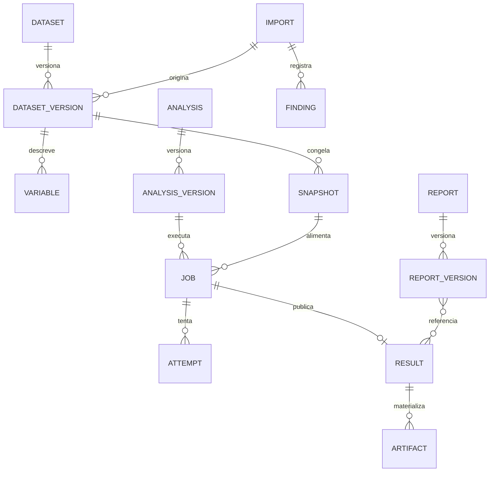
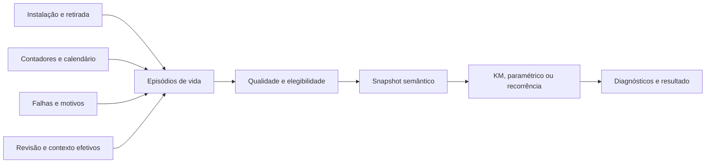

# Modelo semântico, persistência e governança dos dados

**Status:** modelo lógico proposto; não é DDL executável. A implementação deverá compatibilizar IDs, tipos, chaves e migrações com o banco efetivamente instalado. Data: 30/09/2026.

## 1. Unidade de análise antes de tabela

Não começar por “juntar todos os dados”. Cada dataset possui um **grão declarado**: uma linha por episódio de componente, evento de falha, intervalo de parada, período de demanda, recebimento de linha de pedido ou leitura de condição. Combinar grãos sem regra causa duplicação e falsas amostras.

| Dataset semântico | Grão | Fonte atual candidata | Complemento necessário |
|---|---|---|---|
| `component_life_episodes` | Uma vida definida de instância/episódio | instâncias, posições, histórico | evento estruturado, saída, contador na remoção, entrada tardia |
| `repairable_asset_events` | Uma ocorrência qualificada | downtime + ordem | ID de evento independente da ordem, reparo e observação |
| `asset_exposure_intervals` | Intervalo homogêneo de exposição | contadores/calendários | qualidade, origem e contexto de operação |
| `asset_downtime_intervals` | Intervalo consolidado | downtime_records | sobreposição, planejada/não planejada, recorte na janela |
| `material_demand_periods` | Item/local/período | movimentos, materiais, ordens | natureza da saída, zeros válidos, ruptura e atribuição |
| `supplier_receipt_lines` | Evento de recebimento por linha | pedidos/manutenção | histórico de parcial, promessa versionada, aceite |
| `condition_measurements` | Sensor/métrica/instante | condition_readings | instrumento, qualidade, coleta e carga |
| `configuration_exposure` | Configuração válida por intervalo | revisões/histórico | estado efetivo as-maintained e intervalo verificável |

Todos os nomes acima são propostas. O código possui partes dessas fontes, não prova população histórica completa ou cadastro real de todos os domínios.

## 2. Dicionário de variáveis

Uma variável precisa ter identidade estável, nome técnico, rótulo localizado, tipo físico, tipo estatístico, papel semântico, domínio, unidade canônica, unidade original, nullable, categorias/códigos, precisão, limites plausíveis, sensibilidade, fonte e regra de derivação.

Exemplos:

| Variável | Tipo estatístico | Papel | Regra |
|---|---|---|---|
| Horas de vida | Contínua positiva | duração | Diferença entre contadores válidos do episódio |
| Evento observado | Binária | evento | 1 falha qualificada; 0 censura conhecida; desconhecido separado |
| Motivo de saída | Nominal | mecanismo de observação | Falha/preventiva/transferência/descarte/desconhecido |
| Fabricante | Nominal | agrupamento | Identidade normalizada com mapeamento auditado |
| Vibração RMS | Contínua | condição | Unidade e frequência/banda de medição explícitas |
| Quantidade demandada | Contagem ou contínua | demanda | Tipo depende da unidade do material |
| Lead time | Duração | resposta | Marcos inicial/final definidos |
| Temperatura | Contínua | contexto/resposta | Conversão afim correta, não apenas fator |
| Serial | Identificador | vínculo | Nunca tratar como variável numérica contínua |

IDs, códigos, serial e zeros à esquerda permanecem strings quando necessário. Números monetários e IDs grandes não devem perder precisão ao atravessar JSON/JavaScript. Internamente usar tipos apropriados; serialização explicitada.

## 3. Episódio de vida e reconstrução histórica

Campos lógicos mínimos: `tenant/org`, `episode_id`, `instance_id`, `position_id`, `asset_id`, fabricante/PN/lote, modelo contextual, marco inicial, entrada em observação, saída/fim do acompanhamento, contador inicial/entrada/final, base de tempo, evento, modo/mecanismo/causa, motivo de saída, ordem e qualidade.

### 3.1 Regras de integridade

1. Saída não antecede instalação; contador final não antecede inicial sem reset documentado.
2. Uma instância física pode ter vários episódios por retirada/reinstalação; isso não cria independência estatística automaticamente.
3. Uma posição não tem duas instalações ativas simultâneas sem multiplicidade física prevista e identificada.
4. Serial não é globalmente único por suposição: usar fabricante/PN/organização conforme domínio real.
5. Estado atual `failed` não informa sozinho todas as falhas passadas ou seu instante.
6. Falha, retirada e fechamento de ordem são marcos diferentes.
7. Não preencher `event=0` quando motivo de retirada é desconhecido; manter informação não resolvida.
8. Mudança de fabricante/configuração fica vinculada ao instante efetivo, não ao cadastro atual retroativamente.
9. Contador ausente não é zero; interpolação precisa de política explícita e qualidade marcada.
10. Várias ocorrências na mesma máquina exigem cluster/estrutura recorrente conforme método.

### 3.2 Derivação segura de duração

Preferência: contador final validado − contador inicial validado. Alternativa: duração de operação reconstruída por intervalos/calendário conhecido. Idade de calendário é outra variável, nunca substituição silenciosa. Registrar método de exposição em cada linha e percentual por categoria no relatório.

No corte do snapshot: unidade em operação é acompanhada somente até última exposição confiável. Se leitura mais recente antecede o corte, não inventar horas adicionais. Para entrada tardia, preservar idade na entrada e idade final. Para censura intervalar, preservar limites; não escolher ponto médio automaticamente.

## 4. Entidades analíticas propostas

Padrão comum: ID opaco, organização/tenant obrigatório, proprietário, timestamps, status, versionamento e referência de auditoria. `workspace` só se torna chave de autorização após modelo de membership real ser definido; não confiar na palavra workspace do frontend.

| Entidade | Campos e finalidade | Integridade |
|---|---|---|
| `analytics_data_sources` | domínio, origem, catálogo, política de acesso | Apenas fontes aprovadas; sem credencial na definição |
| `analytics_datasets` | nome, objetivo, grão, dono | Cabeçalho estável |
| `analytics_dataset_versions` | versão, plano, filtros, joins, transformações | Versão fechada não é editada |
| `analytics_variables` | dicionário tipado/semântico | Referência a versão e identidade estável |
| `analytics_dataset_snapshots` | versão, corte, objeto, schema, contagens, hashes | Publicação atômica; imutável após pronto |
| `analytics_snapshot_sources` | fonte, watermark, registros/manifesto | Linhagem por snapshot e escopo |
| `analytics_analyses` | título, pergunta, proprietário | Definição separada de execução |
| `analytics_analysis_versions` | método, versão, mappings, parâmetros | Nunca sobrescrever contrato executado |
| `analytics_jobs` | snapshot, análise, engine, estado, lease, quota | FK entre objetos do mesmo tenant |
| `analytics_job_attempts` | tentativa, runtime, recurso, erro, heartbeat | Fencing token e resultados de tentativa válida |
| `analytics_results` | job, schema, resumo, diagnóstico, hash | Um resultado publicado por execução válida |
| `analytics_artifacts` | tipo, objeto privado, tamanho, hash, retenção | Não aceitar URL arbitrária do worker |
| `analytics_recommendations` | regra, versão, candidato, justificativa | Persistir evidência da seleção |
| `analytics_assumption_checks` | tipo, severidade, resultado, método | Separar impeditivo de advertência |
| `analytics_reports` | título, objetivo, dono, contexto | Cabeçalho sem conteúdo mutável aprovado |
| `analytics_report_versions` | resultados, texto, status, aprovação, hash | Versão aprovada imutável |
| `analytics_templates` | domínio, contratos, defaults, versão | Templates não contêm código arbitrário |
| `analytics_imports` | usuário, bruto, tamanho, hash, estado, política | Quarentena independente de dataset |
| `analytics_import_findings` | código, severidade, localização segura | Evitar expor conteúdo hostil/segredo |
| `analytics_audit_events` | ator, ação, objeto, escopo, correlação | Escrita protegida; payload mínimo |
| `analytics_resource_scopes` | objeto, unidade/ativo, classificação | Política de acesso não depende de IDs enviados |
| `analytics_decision_links` | resultado, recomendação humana, ação | Não confundir execução com decisão |

### 4.1 Relacionamentos

O diagrama é lógico: relação N:N relatório/resultado requer entidade associativa na implementação. Chaves compostas ou restrições equivalentes devem impedir referência cruzada de tenant no banco, além dos checks de aplicação. Não permitir objeto sem organização por conveniência. Fornecedores globais presentes no código precisam de política explícita: cadastro compartilhado não libera dados transacionais de outras organizações.

### 4.2 Índices e cardinalidades

Consultas usuais: tenant + proprietário + atualização; tenant + estado de job + data; análise/versionamento + execuções; dataset/versionamento + snapshots; tenant + import/finding; tenant + evento/tempo. Índices devem ser escolhidos por planos medidos. Contagem real e registros de qualidade não dependem de LIMIT da interface. Evitar tabelas genéricas de células EAV para todos os dados.

## 5. Pipeline de transformação

Operações declarativas permitidas: selecionar, filtrar, renomear por ID, converter unidade, derivar por operadores homologados, agrupar e agregar, juntar relações cadastradas, mapear categorias, tratar ausência segundo política. Restringir profundidade, número de operações, cardinalidade e custo.

Cada transformação registra versão, input, output, contagens alteradas, valores afetados, motivo, responsável e efeito semântico. Um filtro temporal indica timezone e intervalo fechado/aberto. Unidade de volume, quantidade e temperatura tem conversão específica. Não aceitar função definida pelo usuário como “coluna derivada”.

Dataset possui camadas: bruto privado → representação tipada → dataset semântico → snapshot publicado. Correção posterior do dado de origem não muda snapshot histórico. Nova extração gera nova versão/captura; revisão registra quais resultados ficaram desatualizados.

## 6. Qualidade como objeto de primeira classe

Separar completude, validade, unicidade, coerência temporal, unidade, cobertura, proveniência e adequação ao método. Um score agregado não substitui itens impeditivos.

| Finding | Tratamento padrão |
|---|---|
| Duração negativa ou ordem impossível | Impede análise afetada; corrigir origem |
| Evento desconhecido | Não transformar em censura; perfil disponível |
| Duplicidade provável | Revisar identidade; não deletar por similaridade |
| Unidade incompatível | Bloqueia combinação até conversão validada |
| Contador com reset | Exige segmentos/justificativa |
| Poucos eventos/muita censura | Advertência ou recusa conforme método homologado |
| Outlier plausível | Manter; marcar e oferecer sensibilidade |
| Ausência de campo | Mostrar n afetado e política de exclusão/imputação |
| Série com períodos ausentes | Distinguir coleta ausente de zero |
| Join multiplicador | Impede publicação do dataset |

Limpeza nunca é silenciosa. Para imputação, registrar modelo, treino e seed; não imputar dentro da avaliação usando informações futuras. O relatório mostra população inicial, exclusões por motivo e população final.

## 7. Snapshots, hashes e consistência

O manifesto define ordem de linhas, ordenação estável/chave, ordem de colunas, tipos, unidade, representação de ausência, fuso, versão da transformação e ponto de consistência. Hash de arquivo verifica bytes; hash semântico exige canonicalização definida. Ambos podem ser guardados e responder perguntas diferentes.

Linhas agregadas apontam para IDs ou manifesto de origem privado, conforme volume. Esses IDs também exigem autorização. Drill-down revalida permissões atuais, mesmo se snapshot era acessível antes. Não expor paths internos, nomes de bucket ou dados de outro escopo em erro.

### 7.1 Fluxo de dados de confiabilidade

## 8. Estoque, recebimentos e configuração

Demanda: separar saídas por consumo, transferência, ajuste e devolução; considerar reservas e requisições para observar demanda não atendida. Histórico de saldo ou disponibilidade permite identificar ruptura. MRP precisa de catálogo de origem de demanda para não somar previsão estatística e preventiva representando a mesma necessidade.

Recebimento: evento por linha com quantidade recebida, aceita, rejeitada, data, fornecedor e pedido. Usar promessa original/revisões e instante de envio; campo atual único `received_at` não demonstra histórico de todas as parciais. O dataset completo de supplier deve distinguir pedido encerrado, parcial, cancelado e ainda aberto.

Configuração: snapshots atuais as-designed/as-built são infraestrutura útil, mas o histórico as-maintained efetivo deve ser reconstruído/validado a partir das mudanças. Não relacionar falha antiga à posição atual por conveniência. Estrutura esperada do modelo e componentes efetivamente instalados são dimensões diferentes.

## 9. Retenção, privacidade e backup

Políticas separadas para arquivo bruto, dataset normalizado, snapshot, resultado, relatório aprovado, temporários e logs. Retenção é configurável e deve considerar contrato, incidente, obrigações e custo. Não definir prazo legal universal neste estudo.

Temporários: remover ao fim e usar rotina de recuperação de resíduos após crash. Arquivo rejeitado pode ter retenção curta para suporte/segurança, com acesso restrito e política clara. Relatórios aprovados seguem retenção documental; snapshot necessário à reprodução acompanha a política ou relatório informa perda de reexecutabilidade.

Backup cobre metadados, objetos necessários à reprodução, políticas e chaves recuperáveis. Testar restore consistente entre banco e objetos. Quarentena maliciosa pode ser segregada da rotina normal de backup. Exclusão precisa considerar cache, replicas, exports, backups e legal hold; não prometer apagamento imediato de cópias fora do controle.

Dados de pessoas, fornecedores e custos podem ser sensíveis. Não enviar datasets ao LLM por padrão; pseudonimizar quando possível e exigir política específica para uso externo. **REQUER VALIDAÇÃO JURÍDICA** para retenção, privacidade, residência e direitos de titular nos contextos efetivos de operação.
