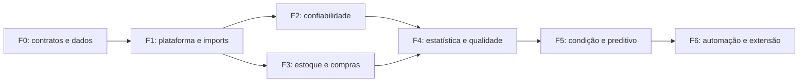

# Roadmap, decisões e handoff de implementação

**Status:** proposta para evolução cumulativa do ASTHA RAVEN. Data: 30/09/2026. Não representa autorização para implementar nesta sessão.

## 1. Ordem recomendada

Corrigir semântica e estabelecer a fundação antes de expandir catálogo. Uma implementação ampla de métodos com dados de exposição incorretos não cria rigor. Não tentar igualar todo o JASP na primeira fase. Entregar capacidades fechadas de ponta a ponta, com contratos acumulativos e sem reescrever a fundação a cada nova análise.

### Dependências

F2 e F3 compartilham fundação e podem ter planejamento independente, mas o cronograma real depende da equipe e dos dados. Não há estimativa confiável de prazo/orçamento sem volume, modalidade de implantação e responsáveis definidos.

## 2. Fase 0 — contratos, dados e preparo

**Objetivo:** fechar o que significam falha, vida, reparo, exposição e demanda no produto. **Entregas:** ADRs, dicionário semântico, contratos de extração, política de permissões, estratégia de deployment e inventário de biblioteca/versões.

Trabalho necessário:

- Revisar métricas existentes apontadas no diagnóstico: janela e sobreposição de downtime, numerador de falhas, denominador de MTTR, calendário/exposição e rótulos Poisson.
- Confirmar modelo físico → modelo técnico e unidade organizacional/funcional.
- Definir evento de falha independente do registro de ordem e da parada.
- Definir episódio de instalação, estado na retirada e leitura de contador histórica.
- Definir demanda, transferência, ajuste, reserva, ruptura e recebimento parcial.
- Fechar identidade organizacional e escopo por planta/ativo sem confiar no frontend.
- Escolher piloto, versões candidatas, formato de snapshot e referência de homologação.

**Gate de saída:** responsáveis de domínio conseguem reproduzir manualmente exemplos pequenos de vida, downtime, taxa e demanda; lacunas históricas documentadas; nenhum campo importante é derivado silenciosamente por suposição.

## 3. Fase 1 — fundação analítica real

**Escopo:** fontes cadastradas; Dataset Builder limitado; versões/snapshots; jobs/attempts; resultados/artefatos; auditoria; autorização; importação CSV/JSON isolada; estatística descritiva; relatório técnico básico real.

Uma fatia vertical obrigatória: usuário autorizado escolhe dados de estoque ou dataset externo permitido → revisa tipos/unidades/qualidade → cria snapshot → executa descritiva no worker → abre tabela/gráfico → consulta origem → gera relatório → outro usuário autorizado verifica manifesto. Usuário de outro tenant não acessa nenhum estágio.

**Não incluir neste gate:** editor livre de código, importação genérica de ZIP, todos os módulos do JASP, modelos preditivos de vida restante e honeypot. A exclusão é decisão de escopo desta fase, não abandono de recursos futuros.

**Gate:** fluxo completo persistido; import hostil contido; jobs recuperam de crash; output validado; licença da composição documentada; reprodução comprovada; UI sem cards fictícios; backup/retention e observabilidade definidos. XLSX pode ser subfase posterior após teste específico.

## 4. Fase 2 — confiabilidade e manutenção

**Entregas:** episódios de componente; exposição qualificada; indicadores corrigidos; Pareto; KM com censura à direita; Weibull 2P e candidatos paramétricos; IC/diagnósticos; comparação exploratória; relatórios revisáveis.

Fatia vertical: selecionar posição/família → revisar episódios e censura → comparar grupos → diagnosticar → registrar limitação → gerar relatório de evidência → abrir investigação humana. Preservar origem e estado histórico.

Depois da base: Cox/AFT, entrada tardia, competing risks, HPP/PLP e recorrências conforme contrato. Não liberar todas as formas de censura com uma única flag; separar capacidades homologadas.

**Gate:** fixtures com zero falhas, mediana não atingida, censura intensa e grupos dependentes geram comportamento correto. “Banheira” mostra dados e suporte; não fabrica três fases. Poisson diferencia taxa estimada, IC, quantil condicional e previsão quando implementada.

## 5. Fase 3 — estoque, sobressalentes e fornecedores

**Entregas:** demanda classificada, calendário de coleta/ruptura, ABC/XYZ configurável e criticidade, previsão por tipo de série, backtest, simulação de política, histórico de recebimentos e promessas, supplier analytics.

Fatia vertical: material crítico → histórico e base instalada → método elegível → cenário com lead time → risco/serviço/custo → proposta → relatório → aprovação de alteração de política. Integrar MRP por contrato evitando duplicar demanda prevista e planejada.

**Gate:** unidades/lotes e position de estoque corretos; pedido parcial não aparece como completo; pedido aberto não desaparece; zeros e lacunas distintos; método avaliado por custo/serviço, não só erro médio. Não chamar ABC/XYZ de otimização automática.

## 6. Fase 4 — laboratório estatístico e qualidade

**Entregas:** contrastes independentes/pareados, regressão/GLM, ANOVA e modelos mistos selecionados, alternativas robustas, multiplicidade/efeitos, distribuição, SPC e capacidade. Gauge R&R e DOE somente com desenho e captura apropriados.

**Gate:** recomendador usa desenho, dependência e objetivo; não escolhe teste somente por n ou normalidade. Capacidade não ignora estabilidade/MSA. Opções avançadas têm contratos e UI consistentes, erro/convergência e fixtures. Métodos bayesianos começam em problema industrial delimitado, com prior/sensibilidade.

## 7. Fase 5 — condição, séries e preditivo

**Entregas:** baselines de condição, qualidade de sensor, alinhamento temporal, modelos de tendência/resíduo, anomalia com revisão, multivariados e monitoramento de drift. RUL somente quando houver dados de degradação, eventos e desenho de validação suficiente.

**Gate:** validação fora do tempo, por máquina/família/site quando necessário; nenhuma informação futura no treino; falsa detecção medida; mudança de sensor separada de degradação. Desempenho em NASA/sintético não é evidência suficiente em equipamento real do cliente.

## 8. Fase 6 — templates, automação e extensão

**Entregas:** catálogo de templates versionados; execução recorrente com novo snapshot; comparação com baseline; relatório em revisão; notificações com relevância; interpretação assistida; extensões controladas.

Extensão inicial é configuração declarativa de métodos homologados. Código de terceiros e notebooks representam outro threat model e necessitam isolamento/contratos próprios. IA propõe definições revisáveis; não obtém shell/SQL arbitrário. Automação opera sob identidade de serviço e escopo revogável; não depende de token pessoal permanente.

**Gate:** jobs recorrentes idempotentes, alertas sem spam, significância prática + persistência + criticidade, reprodutibilidade de cada período e aprovação humana para decisões críticas.

## 9. Backlog com aceite verificável

| ID | Entrega | Dependência | Critério observável |
|---|---|---|---|
| IA-001 | Dicionário de eventos/exposição | Domínio | Exemplo manual e fixtures sem ambiguidade |
| IA-002 | Catálogo de fontes | IA-001 | Campo/relacionamento não cadastrado é recusado |
| IA-003 | Authz Analytics | Identidade real | A/B e escopo planta testados em todos os recursos |
| IA-004 | Definições/versionamento | IA-002 | Alteração não sobrescreve versão executada |
| IA-005 | Snapshot/manifesto | IA-004 | Captura consistente, hash e origem reproduzíveis |
| IA-006 | Jobs/attempts | IA-003/005 | Crash, duplicação, cancelamento e lease tratados |
| IA-007 | Parser CSV/JSON | Política/isolamento | Limites e conteúdo hostil não afetam produção |
| IA-008 | Descritiva/ECDF | IA-005/006 | Referências numéricas e UX real |
| IA-009 | Results/Inspector | IA-008 | População, método, unidade e limites disponíveis |
| IA-010 | Relatório/revisão | IA-009 | Export privado, versão aprovada imutável |
| IA-011 | Episódios de vida | IA-001 + captura | Falha, saída, censura e tempo reconstruídos |
| IA-012 | KM/Weibull | IA-011/006 | Censura e IC homologados, recusa válida |
| IA-013 | Recorrência/métricas | IA-001/006 | Exposição e tipo de evento consistentes |
| IA-014 | Demanda/recebimento | Dados operacionais | Ruptura e parcial disponíveis e rastreáveis |
| IA-015 | Estoque/supplier | IA-014 | Backtest, cenário e denominadores corretos |
| IA-016 | SPC/lab avançado | Contratos/métodos | Desenho e pressupostos não ocultos |
| IA-017 | Condição/preditivo | Qualidade temporal | Baseline e validação fora do tempo |
| IA-018 | Automação/extensão | Fundação homologada | Identidade/escopo, idempotência e relevância |

Cada item inclui UI/backend/persistência/testes/documentação quando aplicável. Não concluir só metade e mover lacunas obrigatórias para “próxima fase”. Requisitos adicionais fora do contrato são backlog explícito, não falsa conclusão.

## 10. Decisões arquiteturais a registrar

| ADR | Proposta inicial | Revisão necessária |
|---|---|---|
| Motor | Python base; R por necessidade | Método/licença/homologação |
| Código JASP | Inspiração; sem incorporação automática | Jurídico se incorporar |
| Integração API | Domínio modular Express | Carga/escala real |
| Fila | Contrato lease/retry independente do broker | Banco/versionamento/ops |
| Dados | Snapshot privado tipado + metadata MySQL | Volume/retenção/custo |
| Import | Parser separado do worker estatístico | Windows versus Linux |
| Authz | Permissão explícita + scope | Membership/hierarquia real |
| Chart | Spike Plotly.js versus ECharts | Acessibilidade/peso/export |
| Relatório | Versão própria de Analytics com revisão | Integração documental |
| IA | Proposta declarativa, sem código livre | Política de dados externos |

## 11. Organização da equipe e esforço

Capacidades necessárias: domínio de manutenção/confiabilidade, estatística aplicada, backend/dados, frontend/UX, infraestrutura/segurança e revisão de licenças. Uma pessoa pode acumular papéis, mas cada responsabilidade precisa de aceite identificável. Recurso open source economiza implementação de alguns cálculos; não elimina preparo de dados, homologação, segurança e UX.

Estimar por fatias verticais e experimentos limitados: levantamento de dados reais; método de referência; protótipo de fluxo; benchmark; matriz de authz; contingência de empacotamento. Não atribuir prazo em semanas a um “clone de todas as funções” sem inventário fechado.

## 12. Handoff para uma próxima etapa autorizada

Uma solicitação de implementação poderá especificar: “Implemente a fase 1 deste conjunto documental, após fechar os ADRs bloqueantes, mantendo os limites de escopo e os gates de aceite.” O agente deve primeiro conferir arquivos atuais e estado do banco em ambiente autorizado, ler AGENTS/skills relevantes e preservar trabalho existente.

Antes de codificar, confirmar: plataforma de execução; IDs/chaves; modelo de permissões; versão do catálogo; formato de snapshot; retenção; política de recursos; métodos iniciais; critérios de homologação e aprovadores. Essas decisões não podem ser inferidas só pelo mockup.

Durante a implementação: construir uma fatia completa; revisar segurança; executar testes apropriados em base descartável; verificar lacunas de ponta a ponta com `finish-partial-work` quando aplicável; corrigir; retestar somente o afetado; registrar pendências. Não rodar `api/migrate.js` ou `api/database/init.js` em banco existente sem autorização específica.

## 13. Pendências registradas ao fim desta pesquisa

1. Não há profiling do banco nem confirmação de qualidade/volume histórico.
2. Membership completo workspace → organização → site → departamento precisa de contrato real.
3. Episódios, motivos de saída e contador final podem exigir complemento operacional.
4. Captura de recebimento por evento e promessa versionada precisa de verificação/implementação futura.
5. Releases e dependências transitivas não foram congeladas nem auditadas com SBOM/SCA.
6. Licenciamento de integração/distribuição requer validação jurídica.
7. Isolamento Linux e Windows exige escolha e teste no ambiente alvo.
8. Benchmarks, SLAs, custos e limites finais não foram medidos.
9. Métodos e limites do recomendador precisam de homologação estatística.
10. Não foi comprovada exclusividade ou disposição de clientes a pagar.
11. Mockups não são protótipo interativo e não passaram por teste de usabilidade.
12. Não houve implementação nem teste dinâmico neste trabalho, conforme solicitado.

Essas pendências são gates explícitos da construção, não código parcialmente entregue. A pesquisa fornece a estrutura para resolvê-las antes de afirmar que o subsistema está pronto.
