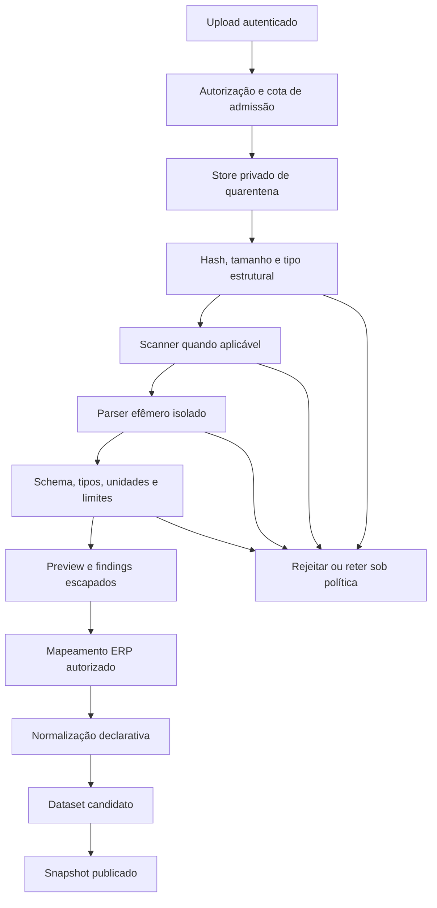
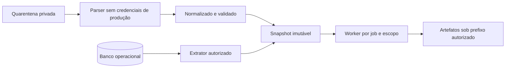
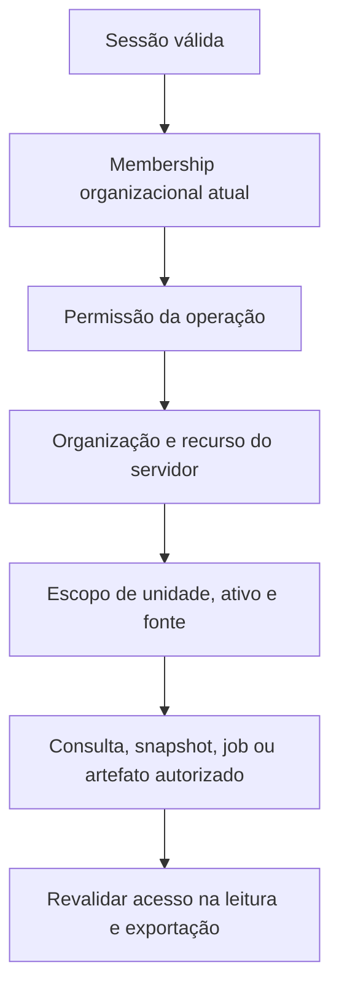

# Segurança de importação, tenants, workers e exportações

**Escopo:** arquitetura proposta e revisão estática dos caminhos relevantes; 30/09/2026. Não é pentest nem certificação. Controles abaixo são requisitos do futuro módulo, salvo indicação expressa de evidência atual.

## 1. Resposta direta: comandos ocultos em CSV/JSON

Um parser seguro lê valores; não os executa. CSV/JSON podem conter strings que parecem comandos e ainda assim ser tratados como texto. O risco aparece em etapas posteriores: interpretação de fórmula pela planilha, HTML em tooltip, SQL concatenado, shell montado com nome de arquivo, merge inseguro de objeto ou vulnerabilidade do parser. Não criar um classificador que prometa reconhecer todos os “comandos ocultos”. Construir fronteiras que impeçam valores de virar código.

Prioridade: prevenção e contenção por desenho; depois detecção e resposta. “Nenhum alerta” não significa arquivo seguro; “parser falhou” não prova tentativa de ataque.

## 2. Ativos, atores e limites de confiança

Ativos: dados industriais e comerciais, identidades, banco, disponibilidade, artefatos, relatórios aprovados, chaves e ambiente de execução. Atores: usuário legítimo, usuário autenticado abusivo, cliente comprometido, upload malformado, dependência comprometida, conta administrativa e operador de infraestrutura.

Fronteiras: navegador/API; API/banco; API/quarentena; quarentena/parser; parser/dataset; fila/worker; worker/artefatos; resultado/renderizador; relatório/download; organização A/B; máquina local/backend remoto.

O parser hostil não recebe acesso ao MySQL operacional. O worker estatístico recebe snapshot mínimo, não credencial administrativa nem JWT do usuário. Uma saída gerada internamente continua sujeita a limites e schema.

## 3. Threat model

| Entrada/caminho | Possível impacto | Controle proposto | Teste necessário |
|---|---|---|---|
| Upload enorme/muitos uploads | RAM/disco/fila esgotados | Streaming, cotas por tenant/usuário, admissão | Limites concorrentes e cancelamento |
| Extensão/MIME falsos | Parser errado | Allowlist e validação estrutural | Conteúdo incompatível/polyglot |
| CSV com fórmula | Execução/exfiltração na planilha | Export tipado, texto literal, política específica | Excel/LibreOffice e save/reopen |
| Texto HTML em célula | XSS em tabela/chart/report | Texto escapado por contexto, sem HTML livre | Payload persistido em todos os destinos |
| JSON profundo/largo | DoS no parse/normalização | Limites estruturais e isolamento antes de promover | Profundidade, nós e strings |
| Chaves perigosas em objeto | Prototype pollution | Schema fechado, sem merge arbitrário | `__proto__`, `constructor`, `prototype` |
| CSV dialeto/encoding ambíguo | Colunas interpretadas errado | Preview e configuração persistida | Aspas, BOM, multiline, separadores |
| XLSX comprimido hostil | ZIP bomb/CPU/memória | Limites expandidos/entradas/tempo | Descompressão incremental |
| XLSX XML/links externos | XXE/SSRF/coleta externa | DTD/entidades e acesso externo desativados | Relações externas e entidades |
| Nome/caminho de arquivo | Traversal/sobrescrita | Nome opaco, diretório fechado | Caminhos Windows/Linux/Unicode |
| Filtro SQL/coluna livre | Injeção ou consulta ampla | Plano validado, campos allowlist, parâmetros | Identificadores/operadores não permitidos |
| ID de snapshot/job de outro tenant | Vazamento/execução alheia | Autorização por objeto em toda operação | Matriz A/B e escopo menor |
| Worker comprometido | Movimento lateral | Sem produção, egress mínimo, privilégios reduzidos | Rede, credenciais, montagem e escape conhecido |
| HTML/PDF externo | SSRF/JS no renderizador | Template controlado, recursos locais, processo isolado | URLs, scripts e timeout |
| Dependência/imagem adulterada | Execução indevida | Proveniência, digest, SBOM e atualização controlada | Validação de cadeia de entrega |
| Dado envenenado | Modelo/decisão enganosa | Proveniência, revisão e monitoramento de qualidade | Alteração de baseline/eventos |
| Texto instruindo IA | Prompt injection futura | Dataset como dado, ferramentas restritas | Instruções em célula não mudam ações |

A matriz é análise de ameaças, não lista de vulnerabilidades exploradas no código atual. SQL/NoSQL injection depende do destino; o projeto observado usa MySQL, portanto NoSQL é risco futuro somente se tal armazenamento for adotado.

## 4. Pipeline de importação

Quarentena não tem URL pública, preview de HTML nem execução. Nome original fica como metadado escapado; nome de objeto é gerado. Scanner auxilia triagem, mas não libera controles. CSV/JSON não possuem assinatura mágica universal; reconhecer por estrutura e política de schema, sem prometer detecção absoluta. [OWASP Upload](https://cheatsheetseries.owasp.org/cheatsheets/File_Upload_Cheat_Sheet.html).

### 4.1 Política inicial sugerida — precisa de benchmark

| Limite | Hipótese inicial para piloto | Motivo |
|---|---|---|
| Upload bruto | 10 MiB por arquivo no piloto | Contenção e operação simples |
| Colunas | 200 | Evitar largura imprevista |
| Linhas | 100 mil no perfil inicial | Job por streaming, não tudo no renderer |
| String por célula | 16 KiB | Evitar textos enormes; documento não é célula |
| Profundidade JSON | 8 para schema tabular | Dataset tabular não precisa de árvore arbitrária |
| Tempo do parser | 30 s por tentativa inicial | Encerrar trabalho adversarial |
| RAM do parser | 512 MiB inicial | Conter pico; calibrar por formato |
| XLSX expandido | 100 MiB e limites por entrada | Arquivo pequeno pode expandir muito |
| Concurrency | 1 importação ativa por usuário no piloto | Admitir recursos previsíveis |

Não são limites universais, SLAs nem medições do sistema. Total de nós, tokens, entradas ZIP, CPU, PIDs, disco e tamanho de saída também precisam de orçamento; controlar durante o processamento. Se caso legítimo exceder, usar fluxo autorizado maior, sem desligar todas as proteções. Os limites do corpo JSON atual da API não substituem os do upload/parser.

### 4.2 CSV

Aceitar dialeto definido ou detecção com confirmação: UTF-8 preferido, separador, decimal, quoting e cabeçalho. Datas ambíguas exigem formato declarado. Exigir número de colunas consistente; cabeçalhos duplicados geram finding/mapeamento. Fórmula é texto; não usar Excel para recalcular durante importação. Um número negativo legítimo não é automaticamente ataque.

Na exportação para planilhas: preferir XLSX com tipos explícitos, strings literais sem fórmulas e sem links externos. Para CSV, definir perfil de consumo, escapar delimitadores/aspas e neutralizar conteúdo potencialmente interpretável conforme consumidores homologados. Prefixo de apóstrofo/aspas sozinho não é garantia; salvar/reabrir pode mudar comportamento. A estratégia pode alterar bytes e afetar reimportação; manter export canônico seguro em formato tipado separado. [OWASP CSV Injection](https://community.owasp.org/attacks/CSV_Injection).

### 4.3 JSON

Aceitar schema fechado: registros tabulares com primitivas tipadas e envelope versionado; nested JSON livre fica fora do piloto. Rejeitar chaves duplicadas conforme política para evitar interpretações divergentes. Limitar profundidade, quantidade de nós, tamanho de string e precisão; rejeitar números não finitos após conversão. Não usar `eval`, construtores, desserialização de código ou deep merge em objetos de configuração.

Chaves perigosas e propriedades herdadas precisam de tratamento explícito; objetos importados não são settings da aplicação. `JSON.parse` por si só não executa código, mas o uso posterior inseguro pode alterar objetos. [OWASP Prototype Pollution](https://cheatsheetseries.owasp.org/cheatsheets/Prototype_Pollution_Prevention_Cheat_Sheet.html).

### 4.4 XLSX

Liberar depois do pipeline CSV/JSON homologado. XLSX é um pacote ZIP/XML; verificar estrutura interna, entradas, caminho, tamanho expandido e relacionamentos. Recusar XLSM/macros e conteúdo macro incompatível com o contrato, mesmo com extensão falsificada. Não executar fórmulas nem confiar em valor de cache de fórmula como medição verificável. Avisar se células de fórmula forem excluídas ou convertidas por política. Sem HTTP para links externos, DTD, entidades e hyperlinks ativos na renderização.

Não extrair um ZIP genérico no filesystem. Não abrir arquivo com aplicativo desktop como etapa da importação. Registrar planilha/intervalo selecionado; várias abas não são juntadas automaticamente. Datas seriais, células mescladas e tipos mistos exigem testes de fidelidade.

## 5. Isolamento dos workers

Baseline proposto: usuário sem privilégio, filesystem de runtime somente leitura, temporário efêmero com cota, CPU/RAM/PID/tempo limitados, sem host mounts sensíveis, sem socket Docker, sem package install e sem egress público. Ao usar URL assinada, ela é curta e limitada ao objeto; se possível, broker prepara input e coleta output sem dar rede ao processo de cálculo.

Container comum compartilha kernel e não é fronteira absoluta. Para workloads hostis multi-tenant, avaliar host dedicado, gVisor ou microVM. gVisor reduz superfície por kernel de aplicação; Firecracker usa microVMs. Ambos exigem configuração, compatibilidade e operação. Não presumir disponibilidade desses mecanismos no Electron/Windows. [gVisor](https://gvisor.dev/docs/), [Firecracker](https://firecracker-microvm.github.io/).

Um processo de worker aquecido pode reter dataset anterior. Preferir job efêmero ou provar reset; nomes temporários e caches incluem tenant e versão. Admissão protege recursos de toda a plataforma, não somente tempo de uma função.

## 6. Autorização e isolamento de tenant

No código atual, `req.user.org_id` vem da sessão validada e os papéis são gerais. Recomendação: permissão analítica positiva e explícita, com scope. CRUD, importação, execução, aprovação e exportação são permissões diferentes. Toda referência cruzada confere tenant; negar por padrão. UI oculta não é autorização.

O snapshot conserva escopo de origem. Um usuário com acesso a uma planta não pode ler um relatório de toda a organização só porque não mostra linhas brutas. Agregados podem revelar dados sensíveis; os mesmos controles se aplicam a resumo, preview, tooltip, busca e export. Política inicial conservadora: acesso ao artefato exige acesso a todo seu escopo; relatório reduzido deve ser nova derivação autorizada e identificada.

Cache inclui tenant, scope/política, snapshot, método e parâmetros. Downloads passam pela API ou URL privada curta após autorização, sem link público permanente. Revogação e retenção devem considerar URLs já emitidas. IDs imprevisíveis não substituem autorização.

Permissões candidatas: dataset.read/create/import, snapshot.create, analysis.read/create/execute, job.cancel, artifact.export, report.create/read/approve, template.manage, analytics.admin. Administração operacional não implica ler todos os dados de clientes; acesso excepcional deve ser autorizado e auditado.

## 7. Detecção, quarentena e honeypot

**Quarentena:** separar arquivo do dataset confiável. **Sandbox:** limitar efeitos durante processamento. **Bloqueio:** negar operação/credencial quando apropriado. **Rate limiting:** controlar abuso/recursos. **Monitoramento:** correlacionar eventos. **Honeypot:** ambiente deliberado de observação com dados sintéticos. São mecanismos diferentes.

Quando parser excede memória/tempo: encerrar processo e marcar limite; não chamar usuário de hacker. Quando scanner identifica malware: impedir promoção, preservar hash/finding e seguir política. Quando há possível comprometimento de worker: isolar host/pool, revogar credenciais, preservar logs seguros, avaliar acesso e recuperar em ambiente limpo. Se produção foi comprometida, não assumir contenção só pelo bloqueio do próximo upload.

Não redirecionar automaticamente uma sessão legítima para ambiente de engano com base em regex. Se deception for adotada: infraestrutura/rede/identidades separadas, nenhum segredo/dado real, egress bloqueado, telemetria própria, orçamento e revisão jurídica. Não contra-atacar nem executar malware para perseguir o invasor. O produto deve informar restrição de importação com motivo operacional, sem revelar assinaturas detalhadas úteis ao atacante.

## 8. Eventos e resposta operacional

Eventos: import.started/completed/rejected; size/decompression/schema limit; parser.timeout/failure; malware.finding; authz.denied; scope.mismatch; job.resource_limit; artifact.policy_denied; report.approved. Registrar ator, objeto, tenant, categoria, correlação, tamanho, versão de política e decisão. Não logar token, arquivo inteiro ou célula hostil sem necessidade e controle.

Separar severidade e natureza: inválido, corrompido, excedido, suspeito, detecção conhecida e incidente confirmado. Alertas operacionais se baseiam em repetição/correlação/impacto; um falso positivo deve poder ser revisado sem liberar o bruto para execução. Controle de reprocessamento exige nova política/versionamento e aprovação administrativa, não bypass invisível.

Runbook mínimo: interromper promoção → preservar metadados → avaliar alcance → revogar acesso comprometido → recuperar serviço limpo → comunicar responsáveis conforme política → corrigir origem → validar antes de reabrir. Prazos e comunicação dependem da organização e das obrigações aplicáveis.

## 9. Limites desta revisão

Não houve exploração, varredura externa, SCA completa, abertura de arquivos hostis, teste de escape ou inspeção de segredos. `api/.env` não foi aberto. Não se provou segurança de todos os caminhos existentes. A etapa de implementação deve usar requisitos selecionados do [OWASP ASVS](https://owasp.org/www-project-application-security-verification-standard/), confirmar versões e executar testes em ambiente descartável antes de aceitar uploads reais.
