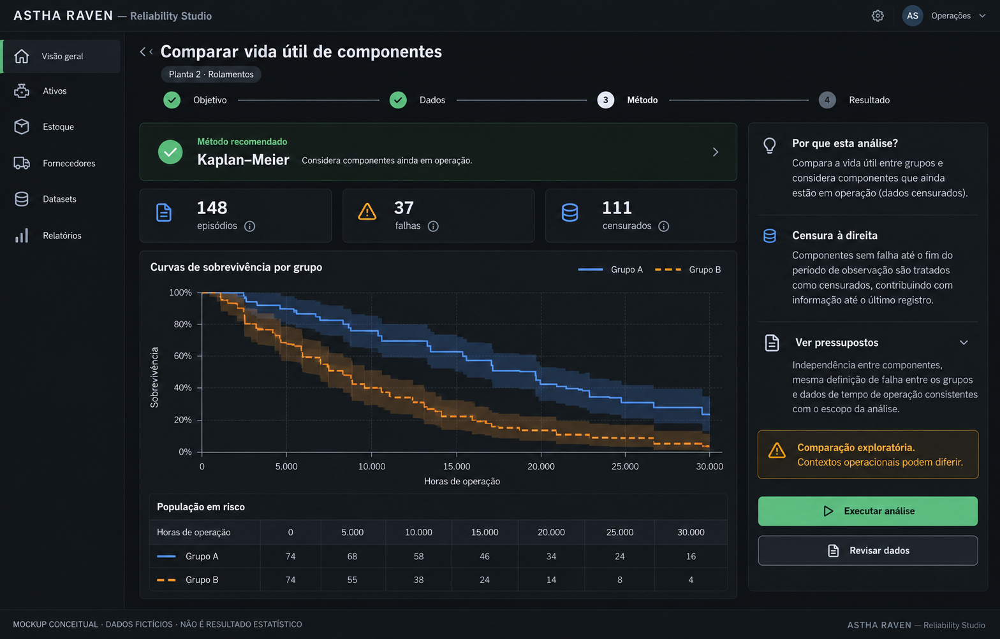

# UX, 15 mockups e exemplos de relatórios

**Natureza:** especificação e mockups conceituais; nenhum frontend foi implementado. **Data:** 30/09/2026. Todos os dados de exemplo são fictícios; formas gráficas são ilustrações de interface, não resultados calculados ou benchmarks.

## 1. Experiência recomendada

A tarefa começa por uma pergunta industrial ou pelo objeto do ERP. Caminhos: Ativo → Confiabilidade; Material → Análises; Fornecedor → Desempenho; Modelo → Frota; Analytics → Estudo global. Esses caminhos usam as mesmas definições de dataset e método, preservando escopo e filtros.

Princípio: lista → ficha do objeto → abas → ação contextual. Manter sessão de análise recuperável, sem formulários enormes empilhados. Guided e Advanced são visões do mesmo contrato; a troca mostra quais parâmetros mudaram. Não refazer análise silenciosamente a cada filtro pesado: preview pode ser interativo, execução gera run versionado.

Personas: técnico precisa de contexto e próxima investigação; PCM precisa de prioridades e limites; confiabilidade precisa de método/diagnóstico; estoque precisa de política/custos/serviço; compras precisa de comparabilidade; gestor precisa de evidência sintética; qualidade/dados precisa de schema e transformação. Simplificar linguagem não significa esconder pressupostos.

## 2. Proposta visual de alta fidelidade



Imagem criada pela ferramenta nativa de geração de imagens, usando a skill imagegen. É proposta estética com dados fictícios. Não usar números, curvas ou tabela de risco da imagem para validar estatística. O wireframe e os contratos abaixo são a especificação funcional; texto produzido na imagem pode exigir refinamento editorial antes de implementação. O prompt final consta em `MOCKUP_PROMPT.md`.

Direção visual: compatibilidade com superfícies escuras, tipografia Inter e tokens existentes, observados em `app/css/variables.css:6`. Cards de evidência, contraste legível e cautela em âmbar; não usar brilho/glass para competir com o dado. Paleta de grupos usa cor + linha/símbolo, independentemente da paleta de severidade. A acessibilidade dos tokens atuais não foi medida.

## 3. Mockups funcionais

Os 15 wireframes abaixo definem hierarquia e navegação. Colchetes indicam controles propostos, não funcionalidades já disponíveis. Números aparecem somente quando necessários à compreensão e são fictícios. “Sem cálculo” é estado real da proposta de tela, nunca resultado prometido.

### Tela 01 — Analytics Home

```text
┌ ASTHA RAVEN · Analytics ────────────────────────────────┐
│ Organização / Planta / Período       [Novo estudo]       │
├──────────────┬──────────────────────────────────────────┤
│ Visão geral  │ Investigar:                              │
│ Estudos      │ [Vida útil] [Falhas] [Condição]            │
│ Datasets     │ [Estoque] [Fornecedores] [Qualidade]       │
│ Relatórios   ├──────────────────────────────────────────┤
│ Templates    │ Estudos recentes · estado · responsável   │
│              │ Dados a revisar · cobertura · origem       │
│              │ Modelos industriais disponíveis           │
└──────────────┴──────────────────────────────────────────┘
```

Objetivo: encontrar uma investigação e retomar trabalho. Cards de alertas só existem com cálculo e critério de relevância definidos. Sem dados: explicar a fonte necessária e oferecer perfil/importação, respeitando permissão. Não inventar “MTBF caiu 17%” como decoração.

### Tela 02 — Asset Reliability

```text
┌ Ativos / Compressor CP-04 · Confiabilidade ──────────────┐
│ Visão geral | Estrutura | Manutenção | Confiabilidade    │
│ [Período] [Base: horas medidas] [Revisar exposição]       │
├─────────────────────────────────────────────────────────┤
│ Falhas qualificadas │ Exposição │ Reparo │ Disponibilidade│
│ Qualidade: contador incompleto · consultar lacunas       │
├──────────────────────────────┬──────────────────────────┤
│ Histórico de eventos         │ Investigações elegíveis  │
│ Linha temporal com paradas   │ [Pareto] [Recorrência]    │
│ [Ver eventos de origem]      │ [Componentes]            │
└──────────────────────────────┴──────────────────────────┘
```

Indicadores mostram numerador/denominador e qualidade. Ativo reparável não recebe automaticamente Weibull de todas as suas ocorrências. O usuário pode migrar para episódios de componentes ou primeira falha, explicitando a pergunta. Estado sem exposição: bloquear taxa, permitir contagem descritiva.

### Tela 03 — Guided Analysis

```text
┌ Novo estudo · Comparar vida útil ────────────────────────┐
│ Objetivo → Dados → Método → Revisão → Execução           │
├─────────────────────────────────────────────────────────┤
│ População: episódios de rolamentos · Planta 2            │
│ Exemplo fictício: 148 episódios · 37 eventos · 111 censuras│
│ Agrupar por [Fabricante] · Base [Horas de operação]       │
├──────────────────────────────┬──────────────────────────┤
│ Candidato: Kaplan–Meier      │ Por que este método?     │
│ Considera tempo observado    │ Há unidades sem falha    │
│ e componentes ainda ativos   │ Rever motivos de saída   │
│ [Alternativas] [Configurar]  │ Dependência por ativo?   │
├──────────────────────────────┴──────────────────────────┤
│ [Voltar] [Salvar rascunho]           [Revisar e executar]│
└─────────────────────────────────────────────────────────┘
```

Execução só após schema e população resolvidos. Explicar censura: “Ainda não vimos a falha; sabemos que o componente operou até a última observação.” Mensagem da recomendação inclui regra/versão e limitações; não dizer “o teste correto” de forma absoluta.

### Tela 04 — Advanced Statistical Lab

```text
┌ Laboratório · Estudo AL-024 · Snapshot v3 ───────────────┐
│ [Método] [Salvar versão] [Executar] [Abrir modo guiado]   │
├────────────────┬─────────────────────┬──────────────────┤
│ Variáveis      │ Configuração        │ Resultados       │
│ duração · h    │ Resposta / grupos   │ Sem cálculo novo │
│ evento · 0/1   │ Censura suportada   │ Última run: v2   │
│ fabricante     │ Estimador / IC      │ Ver diferenças   │
│ ativo · cluster│ Diagnósticos        │ Método / tabelas │
│ carga          │ Política de ausentes│ Warnings         │
└────────────────┴─────────────────────┴──────────────────┘
```

Opções aparecem conforme contrato do método. Não oferecer checkbox de censura intervalar se a classe escolhida não suporta. Exibir parâmetros alterados em relação à execução anterior. Sem editor livre de R/Python/SQL no produto inicial.

### Tela 05 — Dataset Builder

```text
┌ Dataset · Vida de componentes ──────────────────────────┐
│ [Fonte: Episódios] [Grão: um episódio por linha]          │
├───────────────────┬─────────────────────────────────────┤
│ Campos disponíveis│ Selecionados                        │
│ Identidade        │ duração · evento · fabricante       │
│ Exposição         │ posição · modelo · contexto         │
│ Falha/contexto    │ Filtros: categoria / período / planta│
├───────────────────┴─────────────────────────────────────┤
│ Preview amostral · total completo separado               │
│ Linhagem · joins permitidos · cobertura · exclusões       │
│ [Revisar qualidade]                   [Criar snapshot]   │
└─────────────────────────────────────────────────────────┘
```

Fonte tem grão e relações aprovadas. Preview exibe se é amostra. Joins não são livres; advertência para cardinalidade multiplicadora. “Todos os itens” significa toda população no escopo autorizado e nos critérios, não leitura irrestrita de todas as tabelas.

### Tela 06 — Dataset Import

```text
┌ Importar dados ─────────────────────────────────────────┐
│ Upload → Verificação → Preview → Mapeamento → Publicação │
├─────────────────────────────────────────────────────────┤
│ [Selecionar CSV/JSON permitido] Política e limites        │
│ Estado: em quarentena · verificação em andamento         │
│ Arquivo bruto não está disponível para análise           │
├─────────────────────────────────────────────────────────┤
│ Dialeto / codificação / datas / decimal                   │
│ Coluna original → Tipo → Unidade → Papel → Vínculo ERP   │
│ Findings por categoria · sem executar células            │
│ [Cancelar] [Salvar mapeamento]           [Publicar dados]│
└─────────────────────────────────────────────────────────┘
```

Estado rejeitado explica limite/schema e próximo passo legítimo. Não exibir conteúdo bruto como HTML ou nome de scanner detalhado. Usuário revisa transformações; importação analítica não atualiza ativos/materiais automaticamente. XLSX só aparece habilitado depois da homologação.

### Tela 07 — Variable Inspector

```text
┌ Variável · Horas observadas ────────────────────────────┐
│ Tipo físico: decimal   Tipo estatístico: contínuo        │
│ Papel: duração         Unidade original → canônica       │
├─────────────────────────────────────────────────────────┤
│ n válido / ausente · mínimo / mediana / máximo            │
│ Distribuição empírica · valores extremos identificados   │
│ Origem: contador final menos inicial                     │
│ Qualidade: resets, lacunas, datas e duplicidades          │
│ [Ver registros] [Alterar mapeamento] [Ver transformação] │
└─────────────────────────────────────────────────────────┘
```

Detecção de tipo é sugestão, não decisão silenciosa. Valores negativos em temperatura podem ser válidos; em vida podem ser inconsistência. Trocar unidade/tipo cria versão, mostra impacto e invalida compatibilidade de resultados posteriores quando necessário.

### Tela 08 — Results Workspace

```text
┌ Estudo · Resultado run 12 · Concluído com advertências ──┐
│ Resumo | Estimativas | Gráficos | Diagnóstico | Dados     │
│ Método | Pressupostos | Limitações | Reproduzir           │
├──────────────────────────────┬──────────────────────────┤
│ Efeito + intervalo           │ População/exclusões      │
│ Visual principal             │ Censura e exposição      │
│ Tabela equivalente           │ Método/versionamento     │
│ [Inspecionar gráfico]        │ [Consultar origem]       │
├──────────────────────────────┴──────────────────────────┤
│ [Nova execução] [Criar relatório] [Propor investigação]   │
└─────────────────────────────────────────────────────────┘
```

Convergência e qualidade ficam visíveis no resumo. Advertência séria pode impedir ação operacional mesmo com cálculo disponível. Execução falha não exibe gráfico parcial como resultado completo. “Reproduzir” distingue mesma entrada de atualização com dados recentes.

### Tela 09 — Weibull Analysis

```text
┌ Vida de componentes · Weibull 2P ────────────────────────┐
│ [População] [Base temporal] [Método: MLE] [IC: 95%]       │
├──────────────────────────────┬──────────────────────────┤
│ Probability plot            │ β forma + IC             │
│ Pontos/ajuste/diagnóstico    │ η escala + IC            │
│ Região observada/extrapolada │ B10 + IC quando estimável│
├──────────────────────────────┴──────────────────────────┤
│ Comparar candidatos · suporte na cauda · convergência    │
│ “β não identifica sozinho o mecanismo de falha.”         │
│ [Detalhes do ajuste] [Sensibilidade] [Relatório]          │
└─────────────────────────────────────────────────────────┘
```

Curva de distribuição e hazard têm abas distintas. β/η exibidos com parametrização inequívoca. Weibull 3P fica em opção avançada condicionada; não é default. Sem estimativa confiável: motivo e alternativa, sem preenchimento de números.

### Tela 10 — Kaplan–Meier Comparison

```text
┌ Comparação · Grupo A / Grupo B ──────────────────────────┐
│ Sobrevivência · base em horas · período e filtros        │
├─────────────────────────────────────────────────────────┤
│ 1 ┤──────┐      A: linha sólida, censura +               │
│   │      └───┐  B: linha tracejada, censura ×             │
│   │ ┄┄┄┄┐    └──                                       │
│   │     └┄┄┄┐                                           │
│ 0 └────────────────────── horas                         │
│ Bandas de IC e tabela de população em risco              │
├─────────────────────────────────────────────────────────┤
│ n/eventos/censuras por grupo · diferenças de contexto    │
│ [Contraste homologado] [Modelo ajustado] [Ver episódios] │
└─────────────────────────────────────────────────────────┘
```

A linha é em degraus. Não atribuir parte da figura a fabricante real. Curvas cruzadas, cauda com pouco risco e grupos não comparáveis têm avisos. O tipo de contraste, horizonte e ajuste de múltiplas comparações aparecem junto ao resultado.

### Tela 11 — Failure Analysis

```text
┌ Falhas · Família de bombas ──────────────────────────────┐
│ [Período] [Planta] [Modo] Métrica [Horas de parada]       │
├──────────────────────────────┬──────────────────────────┤
│ Pareto                      │ Eventos selecionados     │
│ Barras ordenadas + acumulada │ Ativo / ordem / causa    │
│ [Alternar frequência/custo] │ [Consultar histórico]    │
├──────────────────────────────┴──────────────────────────┤
│ Exposição / taxa quando disponíveis · criticidade        │
│ “Muitas ocorrências não significam maior risco sozinhas.” │
└─────────────────────────────────────────────────────────┘
```

Seleção de uma barra filtra eventos, sem mudar silenciosamente estudo salvo. Diferenciar sintoma, mecanismo e causa. Se causa não confirmada, rotular. Perdas por produção e custo contábil não são somados sem regra explícita.

### Tela 12 — Inventory Analytics

```text
┌ Material BRG-6205 · Análises ────────────────────────────┐
│ Histórico | Demanda | Reposição | Criticidade | Estudos  │
├──────────────────────────────┬──────────────────────────┤
│ Demanda temporal + rupturas  │ Posição de estoque       │
│ Planejada / emergencial     │ Reservas / trânsito      │
│ Baseline / previsão / PI    │ Serviço-alvo definido    │
├──────────────────────────────┴──────────────────────────┤
│ Cenários: investimento / risco / lead time               │
│ Política atual vs proposta · pressupostos e backtest     │
│ [Revisar proposta] [Gerar relatório]                     │
└─────────────────────────────────────────────────────────┘
```

Política proposta não é aplicada com um simples clique no gráfico. Mostrar custo, lote, unidade e criticidade. Marcar horizonte em que dados sustentam previsão. Demanda intermitente não recebe curva Normal por decoração.

### Tela 13 — ABC/XYZ

```text
┌ Classificação de estoque ───────────────────────────────┐
│ Base ABC [Valor de consumo] Período [12 meses]           │
│ Regra XYZ [Política versionada] [Ver limitações]         │
├─────────────────────────────────────────────────────────┤
│              X             Y             Z             │
│ A       itens / valor  itens / valor  itens / valor      │
│ B       itens / valor  itens / valor  itens / valor      │
│ C       itens / valor  itens / valor  itens / valor      │
│ Sem classificação: média zero, ausência ou regra inválida│
├─────────────────────────────────────────────────────────┤
│ Filtro criticidade · lista vinculada · ação de revisão    │
└─────────────────────────────────────────────────────────┘
```

Mostrar limiares e exceções; não ocultar “sem classificação”. Célula selecionada abre lista de materiais com origem da classe. Peça crítica não se torna irrelevante por ser C. Comparar versões de regra quando resultados mudam.

### Tela 14 — Supplier Analytics

```text
┌ Fornecedores · Comparação por categoria/material ───────┐
│ [A] [B] [Período] [Promessa original] [Mix comparável]    │
├──────────────────────────────┬──────────────────────────┤
│ ECDF / dispersão lead time   │ OTD / OTIF / n elegível   │
│ Mediana / cauda              │ Pendentes / parciais     │
│ Pedidos abertos identificados│ Aceite e não conformidade│
├──────────────────────────────┴──────────────────────────┤
│ Incerteza · efeito do mix · histórico de promessas        │
│ [Ver pedidos] [Estudar política de fontes] [Relatório]   │
└─────────────────────────────────────────────────────────┘
```

OTD e OTIF explicam denominador; pedidos abertos e cancelados aparecem. Evitar ranking universal por média ou score opaco. Preço comparado precisa de moeda/unidade/contexto. Sugestão de fonte passa por revisão e qualificação.

### Tela 15 — Statistical Technical Report

```text
┌ Relatório técnico RA-024 · versão 1 · Rascunho ──────────┐
│ [Objetivo] [Escopo] [Resultados] [Limitações] [Reprodução]│
├─────────────────────────────────────────────────────────┤
│ Capa: população, período, responsável                    │
│ Síntese: pergunta, evidência, incerteza                   │
│ Método: parâmetros e população utilizada                │
│ Gráficos + tabelas + diagnostics                         │
│ Interpretação e recomendação operacional                 │
│ Limitações obrigatórias · manifesto e fontes             │
├─────────────────────────────────────────────────────────┤
│ [Solicitar revisão] [Exportar permitido] [Ver versões]   │
└─────────────────────────────────────────────────────────┘
```

Aprovação é ação autorizada; estado aprovado trava a versão. Alteração cria nova versão e explicita supersessão. Relatório pode referenciar vários ativos ou apenas material/fornecedor. Usuário sem acesso ao escopo integral não recebe o export completo.

## 4. Chart Inspector e estados transversais

Inspector lateral: título, pergunta, eixo X/Y e unidades, população, n, filtros, IC/PI e método, transformação, extrapolação, dados de origem e advertências. Abrir por teclado e restaurar foco ao fechar. Tabela equivalente e descrição textual permitem leitura sem percepção da cor.

| Estado | Conteúdo e ação |
|---|---|
| Sem dados | Fonte necessária; criar/importar se permitido |
| Dados insuficientes | Mostrar informação faltante e método exploratório elegível |
| Em fila | Estado real, posição somente se disponível; cancelar se autorizado |
| Preparando/executando | Etapa real; sem percentual fictício; sair e retornar |
| Concluído com warnings | Resultado + severidade + limitações visíveis |
| Não convergiu | Motivo, diagnóstico e alternativas; não fabricar estimativa |
| Limite de recursos | Política e próximo passo; não acusar ataque |
| Sem acesso/revogado | Mensagem sem revelar dados do recurso |
| Dados recentes disponíveis | Run antiga permanece; oferecer nova captura |
| Erro de rede | Estado persistido permite recuperar sem duplicar job |

## 5. Usabilidade, acessibilidade e internacionalização

Definir fluxos de teclado, ordem de foco, labels, diálogos com foco preso/restaurado, status por leitor de tela, títulos e contraste medido. Cor sempre acompanhada de texto/linha/símbolo. Gráficos oferecem tabela e resumo; não depender exclusivamente de hover. Zoom do navegador não corta ações. Layout de laboratório permite recolher painéis e funciona em viewport menor sem eliminar diagnósticos.

Datas exibidas no fuso escolhido; armazenamento e comparação seguem convenção explícita. Decimal/localização muda apresentação, não matemática. Unidade original permanece acessível. Export técnico informa padrão de data/decimal; moeda inclui código e base da conversão. Termos técnicos têm ajuda breve e detalhes para engenharia.

Testes de usabilidade: tarefas de UC01/UC07/UC08 com pessoas do segmento; observar identificação correta de censura, efeito versus p, confiança versus previsão e restrição de dados. Medir sucesso e interpretações equivocadas, não apenas aparência agradável.

## 6. Exemplo reutilizável de relatório de confiabilidade

**Exemplo fictício, sem cálculo.** Título: Comparação de vida de rolamentos de grupos A/B. Objetivo: estimar sobrevivência em horas de operação e investigar diferenças após considerar aplicação. População de ilustração: 148 episódios, 37 falhas qualificadas e 111 acompanhamentos encerrados sem falha observada. Esses números não provam adequação amostral.

**Dados e preparação:** identificar unidade/episódio, corte, contadores e motivos de saída; registrar exclusões e clusters. **Método proposto:** KM exploratório; ajuste paramétrico ou Cox/AFT somente após elegibilidade. **Resultado:** tabelas e curvas somente após execução validada; este exemplo não atribui β, p-valor, HR ou B10 fictício.

**Interpretação sugerida de estilo:** “A comparação deve ser interpretada dentro da população e do período observados. A carga e os motivos de retirada podem diferir entre grupos. Antes de alterar a política de compra, revisar o contexto e a qualidade do acompanhamento.” Não afirmar vantagem de fabricante sem evidência calculada.

**Limitações obrigatórias:** censura potencialmente informativa; exposição incompleta; dependência por ativo; cobertura da cauda; mistura de modos; resultados observacionais. **Recomendação operacional:** investigação documentada. **Reprodução:** snapshot/versionamento/método/parâmetros/ambiente/hashes/revisor. **Status:** documento de exemplo, não aprovado para decisão.

## 7. Exemplo reutilizável de relatório de estoque

**Exemplo fictício, sem cálculo.** Título: Política de reposição do material BRG-6205. Objetivo: comparar política atual e candidatas para uma meta de serviço explicitada. Escopo: local e período autorizados, unidade base, criticidade e equipamentos dependentes.

**Fontes:** consumo classificado, necessidade não atendida, reservas, manutenção prevista, pedidos e recebimentos; não inferir demanda integral somente por saídas. **Preparação:** calendário com zeros válidos, rupturas e cobertura. **Métodos:** caracterização de intermitência, baselines/SBA/TSB candidatos, backtest temporal e simulação de lead time conforme dados.

**Resultados a preencher após execução:** classe ABC/XYZ e versão da regra; desempenho de previsão; viés; nível de serviço por definição; distribuição de estoque; quantidade/custo por cenário; sensibilidade a lead time e criticidade. **Limitações:** demanda censurada por ruptura, poucos eventos, mudança de base instalada, obsolescência e recebimentos incompletos.

**Ação:** proposta revisável; aprovação e conversão de unidade/lote antes de alteração no ERP. **Manifesto:** dados, método, política, seed de simulação, versão de bibliotecas, custo assumido, revisor e hash. Nenhuma quantidade de compra é recomendada neste documento sem cálculo.

## 8. Critérios de aceite da experiência

Usuário consegue responder: qual pergunta foi feita; qual população foi analisada; o que foi excluído; por que o método foi sugerido; qual incerteza; quais limitações; de onde veio o número; como reproduzir; quem pode ver; qual ação está sendo proposta. A interface só é completa quando essas respostas estão disponíveis junto ao backend real e aos testes.
