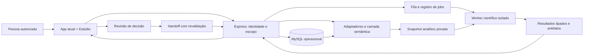
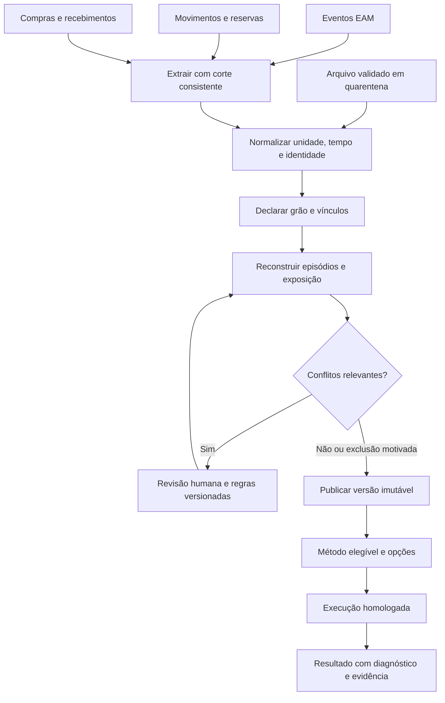
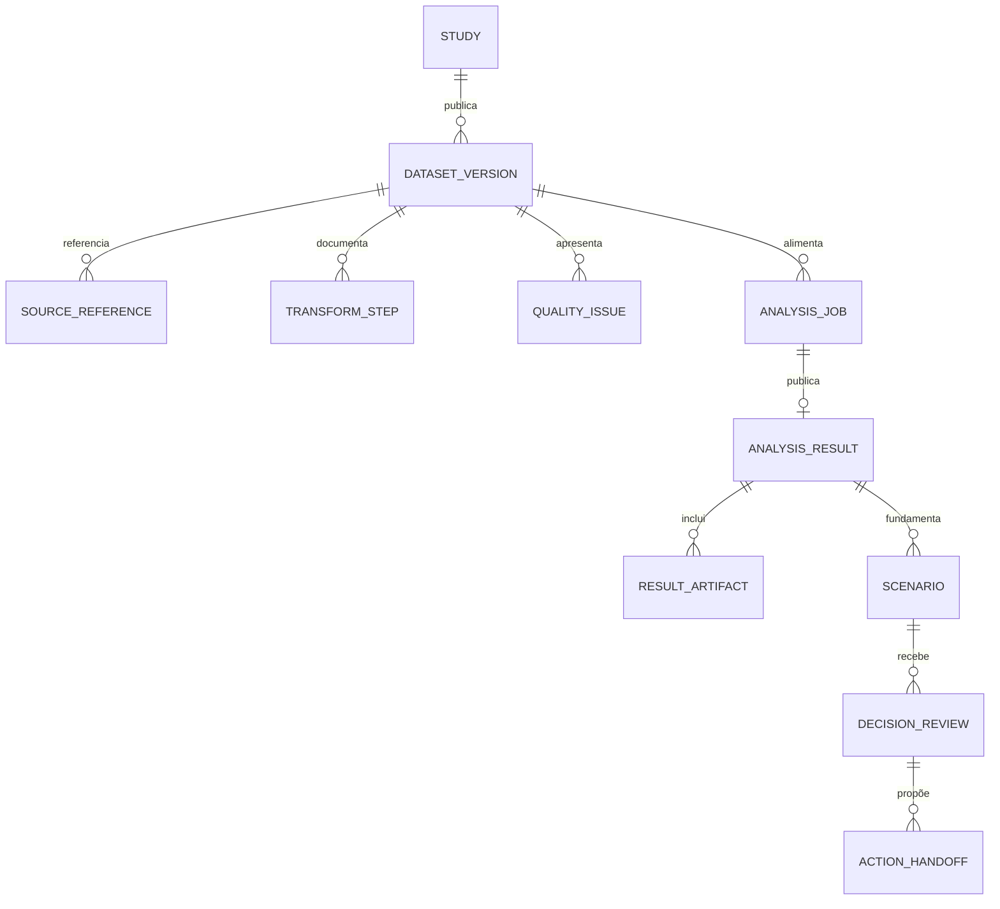
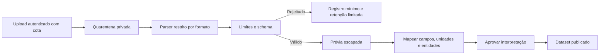
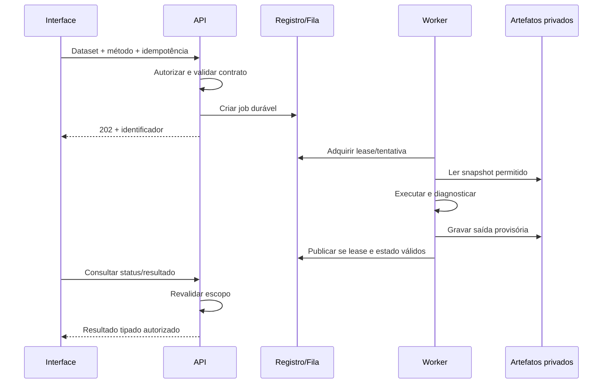
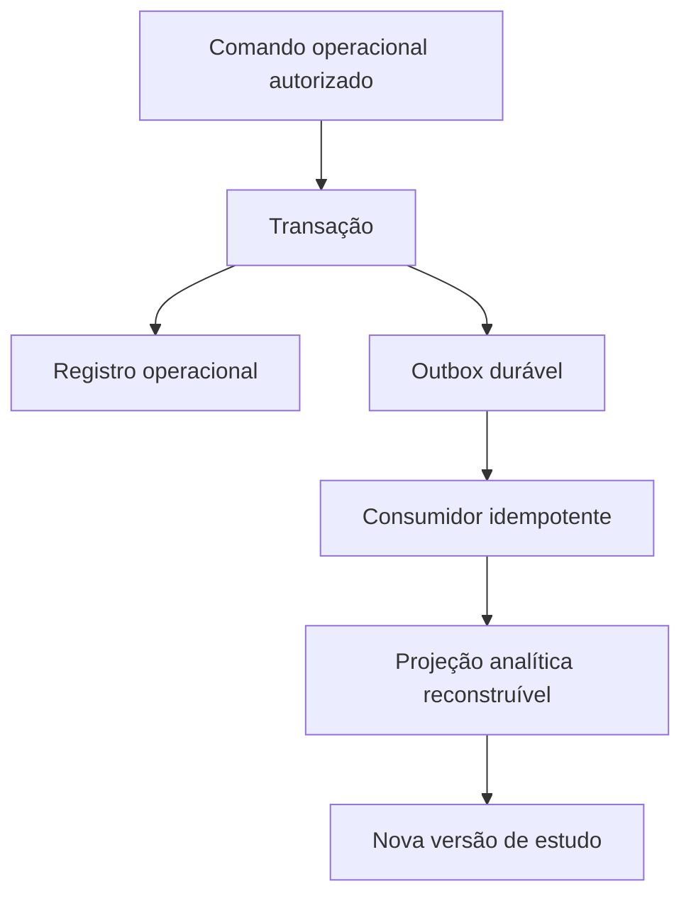
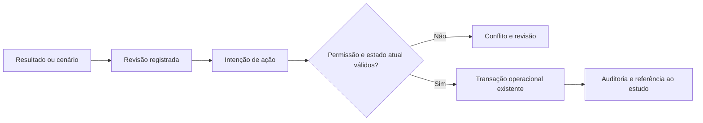

# Arquitetura de construção e operação — extensão v2

30/09/2026 · desenho proposto, sem componentes novos instalados.

## 1. Decisão estrutural

Preservar o app HTML/CSS/JavaScript e Express como interface e fronteira de autorização. Criar camada semântica entre tabelas operacionais e modelos científicos. Um serviço/worker recebe somente datasets publicados e opções permitidas. Importação possui isolamento próprio. A decisão volta ao fluxo operacional após revisão e revalidação.

Não introduzir obrigatoriamente microserviços para cada caixa do desenho. Catálogo, adaptadores, estudos e autorização podem iniciar no backend existente com fronteiras claras; parser e cálculo pesado precisam processo separado. Banco de grafos e data lake não são pré-requisitos do MVP. A evolução é motivada por volume e operação medidos.

## 2. Componentes e limites de confiança

O worker não abre conexão livre ao MySQL operacional. Recebe capacidade de leitura para um snapshot e de escrita em artefatos do job, com expiração quando aplicável. API não aceita runner arbitrário nem caminho de arquivo fornecido pelo usuário. Isolamento é política verificável; iniciar processo filho por si só não constitui sandbox.

## 3. Construção do dado: do registro ao estudo

O corte consistente deve ser definido tecnicamente: transação de leitura apropriada às tabelas/engine ou materialização com revisões/corte explícitos. Não manter uma transação operacional aberta durante todo um modelo científico. Eventos ocorridos depois do corte entram na próxima versão. Sem revisionamento histórico suficiente, a proveniência registra instante de extração e limites de reconstrução.

Joins devem preservar grão. Uma OS com três tarefas e dois materiais não se transforma em seis falhas. Agregar cada relação no grão necessário antes de combinar ou materializar fatos separados. Índices são escolhidos após medir consultas; organização, entidade e tempo são candidatos, não uma receita cega de indexação.

## 4. Modelo conceitual de persistência adicional

Todas as entidades têm organização/escopo, criação e política de acesso. `SOURCE_REFERENCE` não armazena só nome de tabela: precisa ID, revisão/corte e identificador de conteúdo quando aplicável. `TRANSFORM_STEP` registra versão e motivo. `QUALITY_ISSUE` distingue bloqueio, advertência e decisão. `RESULT_ARTIFACT` tem tipo, tamanho, hash e localização privada, não URL pública permanente.

O diagrama não é DDL nem migração. Relações finais, índices, retenção e particionamento dependem de perfil real. Dataset pode ter metadados no MySQL e conteúdo tabular privado em arquivo apropriado; escolher formato e armazenamento após benchmark, distribuição e requisitos de portabilidade.

## 5. Importação segregada

O isolamento do parser é independente do worker estatístico para reduzir superfície e separar quotas. Arquivo original nunca vira script, módulo ou consulta. Preview não renderiza HTML. Limites protegem também descompressão e exportação. Relatórios HTML/PDF podem usar bibliotecas de renderização com superfície própria; tratá-las no inventário de dependências.

## 6. Execução, falha e publicação

Inicialmente polling com backoff pode bastar; SSE é opção posterior. Evitar percentuais artificiais para métodos sem progresso mensurável. Publicação atômica associa resultado e manifesto, então promove artefatos temporários. Falha antes da promoção deixa limpeza recuperável. Retry automático somente para falhas transitórias; parâmetros inválidos e não convergência não se resolvem por repetir indefinidamente.

## 7. Sincronização operacional: snapshot primeiro, eventos depois

Fase inicial: materializar estudo sob demanda com recorte consistente, sem CDC obrigatório. Fase posterior: eventos operacionais duráveis alimentam reconstrução incremental. Se usar outbox, alteração e evento entram na mesma transação; consumidor é idempotente e suporta atraso/reordenação. Não publicar evento apenas depois do commit em memória: falha pode perder sinal.

Não foi constatada uma outbox pronta nesta revisão. A caixa é proposta. Projeções são derivadas: precisam poder ser reconstruídas e não devem substituir o sistema transacional como verdade de estoque. Resultados publicados nunca mudam automaticamente com novos eventos.

## 8. Handoff: análise e ação têm compromissos distintos

Exemplo: cenário recomendou duas embalagens ontem; uma compra foi recebida hoje. Revalidar saldo, reserva, fator e autorização antes da requisição. Referenciar o estudo no comando real permite saber por que ele foi proposto, sem transformar inferência em autorização.

## 9. Formatos de resultado e desenho dos gráficos

Manifesto de resultado: identidade do estudo, população, método/versão, relógio, unidades, parâmetros, estimativas, intervalos, diagnósticos, limitações, origem e artefatos. Gráficos são especificações tipadas com dados autorizados, labels e escalas; worker não entrega código para executar na UI.

Tipos iniciais: série, histograma, ECDF, QQ, boxplot, sobrevivência com censuras/tabela em risco, carta de controle homologada e comparação de cenários. Tooltip informa unidade e significado. Escala truncada e logarítmica precisam sinalização. Cor é acompanhada de texto/forma. Download de tabela oferece alternativa acessível e segue política de exportação segura.

Relatório deve incluir resultados não favoráveis e advertências, não só gráfico principal. Número formatado na UI não altera precisão armazenada. Ao comparar versões, distinguir mudança de dado, definição, método e ambiente; mesmas opções com pacotes diferentes podem não reproduzir exatamente.

## 10. Distribuição: desktop e central

| Decisão | Desktop local | Serviço central |
|---|---|---|
| Motor | Processo empacotado e versionado; cotas locais | Workers com fila, cotas e isolamento por job |
| Dados | Snapshot privado local, proteção por política do dispositivo | Armazenamento privado e acesso por tenant |
| Atualização | Compatibilidade app/runner e migração de metadados | Deploy coordenado e runners coexistentes |
| Compartilhamento | Exportação explícita; limites de governança offline | ACL, expiração/revogação de links e auditoria |
| Segurança | Hardening Electron existente não isola automaticamente parser | Sandbox efetivo, mínimo privilégio e rede restrita |
| Observabilidade | Logs locais sem conteúdo sensível; suporte opt-in | Métricas centralizadas sem payload bruto |

Para Windows desktop, não presumir disponibilidade de Docker ou usar container como pré-requisito invisível. Avaliar estratégia efetiva de processo restrito/serviço remoto com equipe de segurança. gVisor/Firecracker referidos no estudo anterior são alternativas de infraestrutura compatível, não componentes Windows já presentes.

## 11. Registro de decisões arquiteturais proposto

| ADR | Proposta inicial | Evidência necessária para fechar |
|---|---|---|
| A01 — Motor | Python principal; R por necessidade específica | Método, licenças por versão, packaging e comparação numérica |
| A02 — Snapshot | Metadados MySQL + conteúdo privado imutável | Volume, portabilidade, retenção e desempenho |
| A03 — Jobs | Registro durável + fila desacoplada | Concorrência, retry e infraestrutura alvo |
| A04 — Frontend | Integrar stack atual com controlador dedicado | Ciclo de vida, acessibilidade e conflitos entre scripts |
| A05 — Proveniência | Relações simples inspiradas em PROV | Custo de expansão, volume e acesso à fonte |
| A06 — Eventos | Sob demanda inicialmente; outbox se incremental necessário | Latência aceitável e controle transacional |
| A07 — Importação | CSV/JSON tipados; XLSX posterior | Casos reais, limites e testes de parser |
| A08 — Handoff | Intenção revisada + serviço operacional existente | Papéis, stale state, idempotência e auditoria |

Pendências: não há dimensionamento de worker, seleção final de fila/armazenamento, SLO validado, auditoria de licenças de uma distribuição fechada ou perfil real de dados. São decisões de E0/E1, não motivos para instalar ferramentas nesta etapa documental.
