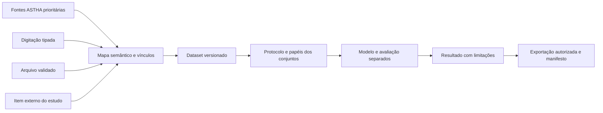

# Inserção, estudos externos, validação e exportação — extensão v3

30/09/2026 · especificação documental · nenhuma implementação no app.

## 1. Produto: integração primeiro, liberdade de estudo também

O estúdio deve ter dois modos complementares: **estudo integrado**, construído prioritariamente com ativos, componentes, ordens, paradas, contadores, condição, estoque, reservas, compras e recebimentos do ASTHA; e **estudo livre do cliente**, para equipamentos, ensaios, processos ou itens ainda inexistentes nos cadastros operacionais. Ambos usam o mesmo motor, contratos, segurança, versões e linhagem.

Um estudo livre pode ser independente ou enriquecido por vínculos opcionais com dados existentes. Exemplo: bancada externa mede uma peça de um lote adquirido no ASTHA; associar lote/material e fornecedor sem inventar um ativo em produção. Outro exemplo: cliente estuda um equipamento antes de comprá-lo; suas medições não viram estoque, OS ou evento de manutenção real.

Tela inicial prioriza “Usar dados do ASTHA”, seguida por “Complementar com medições” e “Criar estudo livre”. Dentro de um estudo integrado, fontes externas aparecem como complemento e sua contribuição permanece identificada. Estudo livre não contorna organização, acesso ou isolamento. Não oferecer automaticamente todas as tabelas de produção a quem pode importar arquivo.

## 2. Três caminhos de inserção

| Caminho | Uso | Registro e revisão |
|---|---|---|
| Dados existentes | Reconstruir histórico e relacionar contextos | Adaptadores autorizados, corte temporal, grão e versão |
| Digitação | Medição de campo, bancada, inspeção ou dado faltante | Formulário/tabela tipados, autoria, unidade, instante, instrumento e justificativa |
| Arquivo CSV/JSON | Volume externo, exportação de instrumento ou dados de validação | Quarentena, schema, prévia, mapeamento, reconciliação e publicação |

Na digitação, escolher objeto observado, variável, valor, unidade, instante/fuso, instrumento ou método de medição, origem e observação. Pode existir medição sem instrumento declarado, mas o desconhecido deve aparecer no registro. Campos essenciais variam: estudo de tempos requer relógio e início/fim; estudo de vida requer evento/censura; inspeção de lote requer plano e amostra.

Tabela editável permite adicionar/copiar linhas e colar valores tabulares em rascunho. Colagem passa pelos mesmos limites, tipos e verificações da importação. Não executar fórmulas. Não tratar célula vazia como zero. Erros numéricos locais — vírgula decimal, separador de milhar — exigem perfil de leitura e prévia, sem conversão silenciosa.

Correção gera revisão com valor original, valor interpretado, responsável e motivo. Não alterar fonte operacional pela tela de estudo. Se cliente desejar gravar medição também no módulo de condição, há comando separado, autorizado e revisado, com definição de deduplicação. Salvar estudo não duplica automaticamente a mesma leitura em condição e analytics.

Estados: rascunho, validando, com pendências, revisado, publicado e substituído por nova versão. Dados não publicados podem ser descartados segundo política; versão publicada mantém trilha e retenção definida. Persistir rascunho não significa validar estatisticamente os dados.

## 3. Mapeamento de arquivo e vínculo com equipamento

Pipeline: formato/separador/charset → cabeçalhos e tipos → unidade/fuso → grão → identificação de objetos → conflitos → publicação. Mostrar colunas originais e campos do estudo lado a lado. Um campo “id” externo não pode se tornar ID de banco sem resolução autorizada.

Cada equipamento/objeto recebe estado: **vínculo confirmado com ASTHA**, **item externo apenas do estudo**, **candidato a vínculo**, **não identificado**. Similaridade de código ou nome só sugere candidato. Confirmar atributo suficiente e contexto; preservar identificador externo e organização de origem. Homônimos entre unidades e reutilização de número de série precisam revisão.

Importar dados de BMB-021 não autoriza acesso ao ativo BMB-021 se o usuário não tem permissão. Informar conflito sem revelar cadastro alheio. Arquivo pode conter dados de várias empresas; o estudo não cruza tenants automaticamente. Compartilhamento interorganizacional seria recurso futuro com autorização explícita e governança própria.

As fontes têm papéis: fonte principal, complemento de covariável/contexto, observação independente, referência de validação, dado sintético ou benchmark. Não misturar sintético e real sem identificação. Reconciliar sobreposição entre arquivo e dados internos antes de somar eventos; um mesmo registro exportado e reimportado continua sendo a mesma observação.

## 4. Objeto externo de estudo: modelo mínimo

| Entidade proposta | Conteúdo | Invariante |
|---|---|---|
| Item de estudo | ID próprio, organização, nome, categoria, identificador externo, origem | Não é um ativo/estoque operacional por padrão |
| Esquema de variável | Código, significado, tipo, unidade, relógio, domínio permitido | Mudança semântica cria versão, não renomeia silenciosamente |
| Observação | Item, instante/período, valores, fontes, papel, revisão | Grão explícito e origem preservada |
| Vínculo de contexto | Item externo ↔ entidade ASTHA, tipo, validade, revisão | Relação não implica identidade nem equivalência técnica |
| Receita de estudo | Fontes, inclusão/exclusão, derivação e papéis dos dados | Mesmas regras versionadas do estudo integrado |

Categorias iniciais: equipamento de ensaio, componente experimental, lote, processo, amostra ou objeto genérico. Evitar criar schema universal rígido com todas as colunas de EAM. Variáveis tipadas permitem tempo, contínua, contagem, categoria e evento; métodos verificam compatibilidade.

Promoção para cadastro operacional é fluxo separado: verificar duplicata, atributos obrigatórios, autorização e aprovação técnica; criar vínculo definitivo e preservar identidade do item de estudo. Não reassociar retroativamente toda observação sem verificar equivalência. Um equipamento candidato pode ser modelo, ativo ou peça — a promoção depende do domínio.

## 5. O que pode significar “dados de validação separados”

| Tipo | Objetivo | Implementação conceitual |
|---|---|---|
| Validação de entrada | Conferir tipo, unidade, identidade, plausibilidade e schema | Regras e revisão antes de publicar |
| Homologação numérica | Conferir cálculo contra valores conhecidos | Fixtures/benchmarks, tolerâncias e runner versionado |
| Validação preditiva | Avaliar generalização e escolher modelo | Desenvolvimento, validação e teste final com desenho adequado |
| Validação externa | Aplicar modelo congelado em outra população/instrumento/período | Dataset independente com contrato compatível e diferenças descritas |
| Confirmação de hipótese | Investigar achado exploratório em novos dados | Protocolo registrado antes de observar resultados confirmatórios |

Um CSV separado não garante independência. Pode conter as mesmas linhas, o mesmo equipamento, medições adjacentes ou informações posteriores ao evento. Também não basta chamar dados de “validação” para provar qualidade científica. Para descritivas ou uma curva de sobrevivência não preditiva, não impor divisão treino/teste desnecessária: validar desenho, método, fonte e diagnósticos.

### Validação preditiva

Separar treino, validação e teste final conforme pergunta. Se objetivo é prever futuro dos mesmos ativos, usar desenho temporal; se objetivo é generalizar para equipamentos novos, separar equipamentos; se ambos importam, usar blocos compatíveis com ambos. Não exigir proibição absoluta de ativos compartilhados em qualquer caso; documentar objetivo e dependência. Janela temporal pode exigir gap para evitar sobreposição de features/desfechos.

Ajustar imputação, escala, seleção de variáveis e modelo somente no treino de cada fold. Aplicar transformação congelada aos conjuntos reservados; escolher hiperparâmetros pela validação ou procedimento apropriado de CV; manter teste final fora da seleção. Essa disciplina evita vazamento e estimativas excessivamente otimistas. [scikit-learn — common pitfalls](https://scikit-learn.org/stable/common_pitfalls.html).

Registrar identidade/versão dos conjuntos, critério de separação, grupos, corte, gap, semente e métricas antes da avaliação. Divisão aleatória simples não atende automaticamente séries ou dados agrupados. Estratégias de CV dependem da estrutura e da pergunta. [scikit-learn — cross-validation](https://scikit-learn.org/stable/modules/cross_validation.html).

Teste final, uma vez consultado e usado para ajustar modelo, deixa de representar avaliação intocada. O sistema registra acesso e nova revisão do protocolo; não apaga histórico para recuperar um selo. Restringir prévia de desfechos do conjunto reservado quando governança permitir; checks de compatibilidade podem ser feitos sem usar desempenho para escolher modelo.

### Avaliação externa e instrumentos

Arquivo de outro equipamento pode validar transporte do modelo ou representar população diferente. Comparar unidades, frequência, range, categoria, sensor, contexto, idade e definição de desfecho. Se variáveis obrigatórias faltam, retornar incompatibilidade; não fabricar valor com IA. Uma diferença de instrumento exige rastreabilidade de calibração e incerteza de medição quando relevantes, não apenas renomear coluna.

Métricas seguem tarefa: regressão, classificação, previsão temporal ou sobrevivência têm critérios próprios. Não usar “acurácia” universal nem limiar comercial sem fundamento. Para dados censurados, avaliação exige métricas e hipóteses compatíveis. Mostrar tamanho, eventos, cobertura, erros e incerteza por grupos relevantes, evitando teste indiscriminado até encontrar resultado favorável.

## 6. Exportação: conteúdo, reprodução e segurança

| Formato proposto | Conteúdo | Limitação |
|---|---|---|
| PDF | População, método, gráficos, resultados, diagnósticos e limitações | Documento estático não executa novamente a análise |
| CSV | Tabela escolhida, IDs permitidos e perfil de unidade/decimal | Não representa todos os tipos, relações e metadados sozinho |
| JSON | Dados tipados, schema e metadados de estudo conforme escopo | Dados, sem instruções executáveis |
| Pacote reprodutível | Manifesto, receita permitida, dados autorizados, versões, opções, seeds e resultados | Requer runner compatível; sem segredos, executáveis ou dependências embutidas por padrão |

Ao exportar, escolher escopo: resultado agregado, dataset analítico ou pacote; incluir/excluir identificadores; selecionar perfil CSV; revisar conteúdo; gerar artefato privado. “Gerar exportação” não publica, não envia e não cria link aberto. Download exige autorização atual e política de retenção.

CSV para planilha precisa tratar risco de células interpretadas como fórmula. Escapar aspas e separadores não resolve sozinho; perfil de cliente e transformação de campos textuais devem ser explicitados. Preservar valores originais no armazenamento; documentar alteração de representação. Não transformar toda quantidade negativa em texto indiscriminadamente. Nenhuma sanitização deve ser vendida como universal para todos os aplicativos de planilha. [OWASP — CSV Injection](https://community.owasp.org/attacks/CSV_Injection).

Exportação omitindo nome não prova anonimização; datas, séries e combinações raras podem identificar pessoas/equipamentos. Aplicar minimização por campo e finalidade; termo correto pode ser pseudonimização. Um agregado com grupo muito pequeno pode expor informação sensível. Política define granularidade e aprovação conforme uso.

Manifesto não inclui tokens, .env, credenciais, caminhos privados desnecessários ou URLs duráveis de objetos. Hash de conteúdo garante integridade, não confidencialidade ou verdade científica. Importar pacote exportado passa novamente por quarentena/schema e resolução de acesso. Uma autorização assinada antiga não concede acesso atual.

## 7. Integração e responsabilidades futuras

Reusar cliente `API`, entradas EAM, listas de ativos e workspace para contexto; resolver dados no servidor. Expandir contratos de `datasets`, `source-adapters` e `jobs` descritos na v2. Acrescentar conceitualmente serviços de itens de estudo, observações, planos de avaliação e exportação; são propostas, não arquivos criados no projeto.

Novas entidades conceituais: item de estudo, vínculo de contexto, versão de observação, papel de dataset, protocolo de validação, conjunto reservado, avaliação e manifesto de exportação. Cada uma possui organização, acesso, versão e origem. Resultados relacionam protocolo e modelos congelados; exports relacionam escopo efetivamente liberado.

Arquitetura adicional:

## 8. Backlog de entregas e aceites

1. **Entrada integrada e manual:** formulário/tabela, unidades, revisão e fonte. Aceite: campo inválido não publica; leitura de estudo não altera operação; correção preserva original.
2. **Importação e reconciliação:** perfis CSV/JSON e estados de vínculo. Aceite: candidato não vira identidade; exportação reimportada não duplica observações silenciosamente; objetos alheios não vazam.
3. **Estudos livres:** entidades próprias, esquema de variáveis e contexto opcional. Aceite: estudo existe sem ativo operacional; vínculo a lote é relação contextual; promoção exige fluxo separado.
4. **Protocolo de avaliação:** papel dos conjuntos e checagem de sobreposição. Aceite: treino não usa desfecho reservado; separação por tempo/grupo corresponde ao objetivo; teste usado na seleção perde selo de intocado.
5. **Exportação:** prévia, escopo, perfis e manifesto. Aceite: resultado e tabela coerentes, dados sem autorização excluídos, risco de fórmula tratado e pacote sem segredos.
6. **Piloto:** tarefas reais com manutenção, laboratório e suprimentos. Medir tempo para montar estudo, erros de vínculo, entendimento do protocolo e completude do relatório; não prometer ganho antes de medir.

As seis novas imagens estão na galeria v3. Documentos anteriores continuam válidos, com esta extensão acrescentando estudos livres e dados independentes. Pendências: amostra real autorizada, políticas de exportação/privacidade, instrumentos e critérios de validação por domínio, distribuição do motor e testes futuros. Nada disso foi implementado ou executado nesta etapa.
