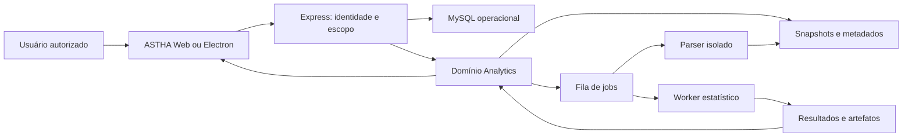
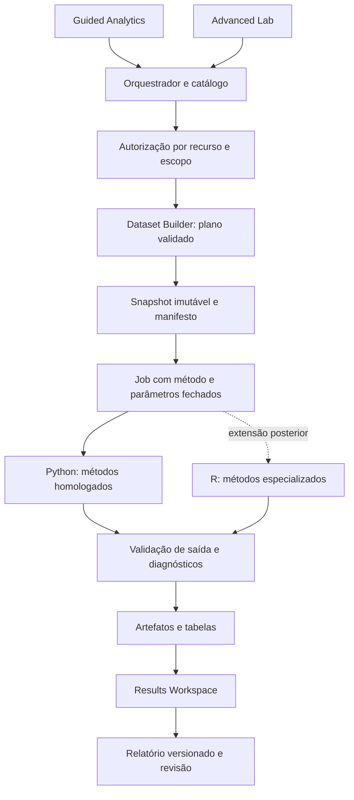
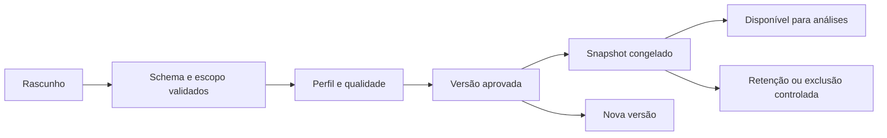
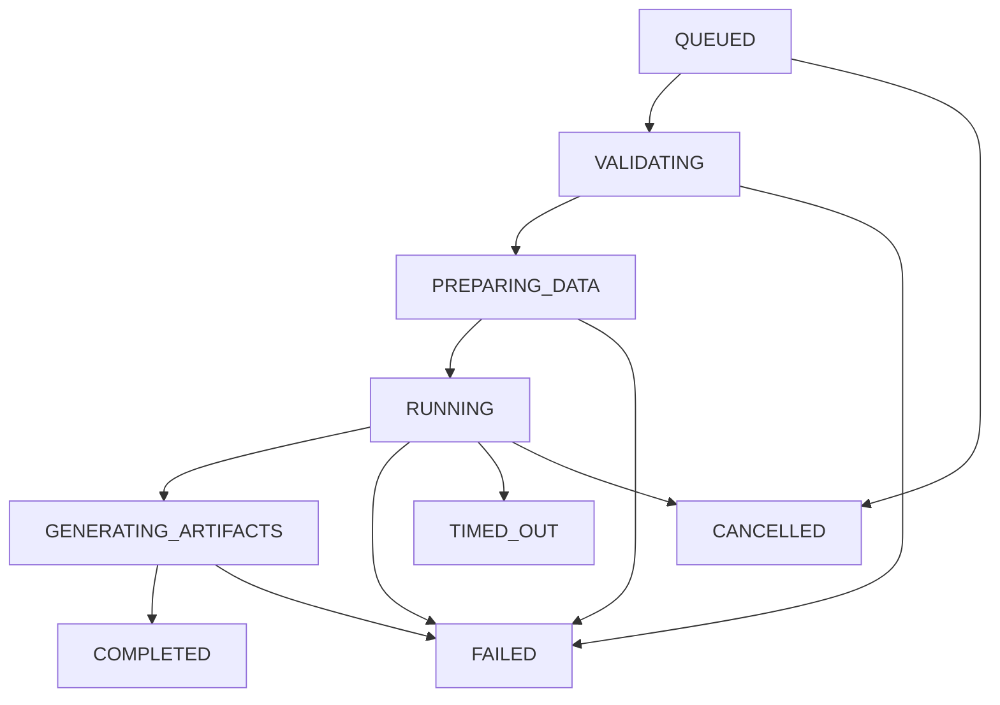
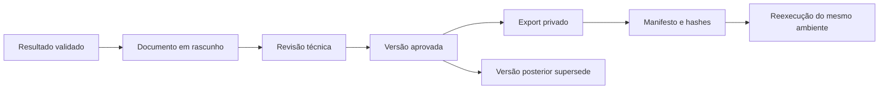

# Arquitetura de Analytics, execução e relatórios

**Recomendação de engenharia**, 30/09/2026. Diagramas representam o sistema proposto. Não existe implantação desta arquitetura nesta entrega.

## 1. Decisão arquitetural

Manter Express/MySQL como camada de identidade, autorização e metadados operacionais. Criar um domínio Analytics com extração semântica, snapshots, definições de análise, jobs e artefatos. Executar estatística fora do processo HTTP, inicialmente em worker Python. Separar parser de importação do worker estatístico. Adicionar worker R somente quando uma capacidade homologada justificar a complexidade.

Não é necessário dividir cada serviço lógico em um microserviço na primeira fase. API Analytics e construtor de snapshot podem começar como módulos do backend, com contratos claros. **A separação operacional do parser hostil e do cálculo pesado é prioritária**, mesmo com um monólito modular na orquestração.

### 1.1 Contexto do sistema

Dados brutos do usuário entram no parser via quarentena, não diretamente no store dos snapshots. O diagrama de contexto simplifica esse caminho; o fluxo de segurança detalha a fronteira.

### 1.2 Topologia funcional

## 2. Comparação das alternativas

| Alternativa | Benefício | Custo/risco | Uso recomendado |
|---|---|---|---|
| Algoritmos em JS na aplicação | Poucas linguagens e implantação simples | Reimplementar otimização/IC/censura e bloquear API/UI | Indicadores simples com contrato e validação; não pacote estatístico geral |
| Serviço Python | Ecossistema numérico, modelos e dados; UI independente | Distribuição de runtime, isolamento e atualização | Base inicial |
| Serviço R | Métodos estatísticos especializados e referências maduras | Licenças por pacote; runtime e suporte adicionais | Extensão quando necessária |
| JASP desktop embutido | Muitas análises prontas | UX, Qt/QML, autorização/dados industriais e copyleft | Não priorizar |
| JASP engine/processo | Aproveitamento de código analítico existente | Não presumir API industrial estável; licença e acoplamento | Somente estudo técnico/jurídico específico |
| Híbrido Python/R | Escolha do melhor método por domínio | Dois ambientes, diagnósticos e homologação duplicados | Arquitetura preparada; implantação gradual |

Precisão não é uma propriedade automática da linguagem. Um método correto com opções erradas gera resultado inadequado. Performance, custo e escala dependem do contrato, volume e hardware; não foram comparados em benchmark nesta pesquisa.

## 3. Bibliotecas candidatas e licenças verificadas

As licenças abaixo foram consultadas em fontes oficiais indicadas. Onde o link aponta para branch, **a versão distribuída ainda não foi escolhida**. Fixar release/commit e revisar árvore transitiva antes da incorporação. Maturidade é apreciação de engenharia do ecossistema, não garantia de segurança ou SLA.

| Biblioteca | Finalidade | Licença no material consultado | Avaliação e recomendação | Risco principal |
|---|---|---|---|---|
| NumPy | Arrays/álgebra | BSD-3-Clause | Base consolidada | BLAS/ABI e diferenças numéricas |
| SciPy | Distribuições, otimização e testes | BSD-3-Clause | Base consolidada | Uso de defaults e domínio do estimador |
| pandas | Preparação e interoperabilidade | BSD-3-Clause | Boa compatibilidade com métodos | Memória e conversões silenciosas |
| Polars | Processamento colunar | MIT | Avaliar para extrações maiores | Conversão para bibliotecas pandas e diferenças de tipos |
| statsmodels | Regressão/inferência/séries | BSD-3-Clause | Selecionar contratos maduros | Diagnóstico/convergência e dependência |
| scikit-learn | ML/PCA/validação | BSD-3-Clause | Fase preditiva; não substituir inferência | Leakage e métricas inadequadas |
| lifelines | KM, Cox, modelos de sobrevivência | MIT | Candidato principal de survival | Suporte varia por classe de modelo/censura |
| reliability | Confiabilidade especializada | LGPL v3 no LICENSE | Avaliação dirigida e jurídica | Não homologar todo pacote por ter nome pertinente |
| survival (R) | KM/Cox/AFT/multiestado | LGPL (>= 2), DESCRIPTION 3.8-13 | Referência e possível worker | Distribuição de R e dependências |
| flexsurv (R) | Sobrevivência paramétrica/multiestado | GPL (>= 2), DESCRIPTION 2.3.2 consultado | Extensão após validação | Copyleft e diferenças de parametrização |
| StatsForecast | Previsão e intermitência | Apache-2.0 | Comparar baselines e métodos suportados | IC não disponível da mesma forma em todos os modelos |
| Plotly.js | Gráficos científicos/interação | MIT | Candidato inicial de visualização | Peso, exportação e contexto de texto |
| Apache ECharts | Dashboard/séries/interação | Apache-2.0 | Alternativa a comparar | Implementar cuidadosamente visuais estatísticos |

Fontes de licença: [NumPy](https://raw.githubusercontent.com/numpy/numpy/main/LICENSE.txt), [SciPy](https://raw.githubusercontent.com/scipy/scipy/main/LICENSE.txt), [pandas](https://raw.githubusercontent.com/pandas-dev/pandas/main/LICENSE), [Polars](https://raw.githubusercontent.com/pola-rs/polars/main/LICENSE), [statsmodels](https://raw.githubusercontent.com/statsmodels/statsmodels/main/LICENSE.txt), [scikit-learn](https://raw.githubusercontent.com/scikit-learn/scikit-learn/main/COPYING), [lifelines](https://raw.githubusercontent.com/CamDavidsonPilon/lifelines/master/LICENSE), [reliability](https://raw.githubusercontent.com/MatthewReid854/reliability/master/LICENSE), [survival](https://raw.githubusercontent.com/therneau/survival/master/DESCRIPTION), [flexsurv](https://raw.githubusercontent.com/chjackson/flexsurv/master/DESCRIPTION), [StatsForecast](https://raw.githubusercontent.com/nixtla/statsforecast/main/LICENSE), [Plotly.js](https://raw.githubusercontent.com/plotly/plotly.js/main/LICENSE), [ECharts](https://github.com/apache/echarts/blob/master/LICENSE).

**REQUER VALIDAÇÃO JURÍDICA:** LGPL/GPL conforme linking, modificações, empacotamento e distribuição real. Mesmo licenças permissivas têm condições de avisos e outros requisitos. Nenhuma linha desta tabela aprova a composição comercial completa do produto. Transitividade, runtime, fontes, dataset e artefatos precisam de inventário próprio.

Regra de seleção: não instalar toda a tabela. Começar com o subconjunto necessário aos métodos da fase. Manter SBOM, hashes, proveniência, versões de runtime e bibliotecas nativas, avisos e procedimento de atualização. Imagem fixada por digest; não instalar pacote durante execução de job. Atualização passa pela suíte numérica e pela análise de compatibilidade antes de receber novos jobs.

## 4. Contratos de integração

### 4.1 Dataset Builder

O navegador escolhe uma fonte cadastrada, campos conhecidos, filtros tipados, agregações permitidas e grão. O servidor valida escopo, permissão, campos, operadores, profundidade e custo do plano. Identificadores SQL são mapeados pelo catálogo; valores são vinculados por parâmetros. Usuário não fornece SQL livre, nomes de tabelas arbitrários, fórmulas executáveis ou funções Python/R.

A fonte deve declarar cardinalidades e chaves. Ordem + materiais + mão de obra + paradas exige agregação separada de cada relação 1:N, antes da combinação. O preview mostra uma amostra identificada; total, n de falhas e qualidade são calculados no dataset completo ou claramente marcados como estimados.

### 4.2 Requisição de execução

Contrato conceitual, sem implementação: identidade de análise/versionamento, snapshot aprovado, método e versão, papéis das variáveis, parâmetros validados, ID de correlação e chave de idempotência. Identidade e escopo efetivo são derivados do servidor. O worker recebe referências opacas a input/output autorizado e manifesto; não recebe token de sessão do usuário.

### 4.3 Resposta analítica

Separar: status, estimativas, IC com método/nível, testes com hipóteses, diagnósticos, dados do gráfico, qualidade, limitações, convergência, manifesto e referências. Cada estimativa inclui unidade, população, n válido/eventos, origem e capacidade de ser estimada. Valores indefinidos são representados por ausência tipada + motivo; não usar NaN/Infinity no JSON final ou zero como substituto.

A API valida também a saída do worker: schema, limites, valores finitos, dimensões, referências de artefatos e tenant. O fato de o worker ser interno não dispensa validar arquivos ou strings que ele produziu.

### 4.4 Mapa de endpoints proposto

| Recurso | Operação | Permissão |
|---|---|---|
| `/api/analytics/catalog` | Consultar métodos elegíveis | leitura do domínio |
| `/api/analytics/datasets` | Criar/consultar definição | create/read |
| `/api/analytics/datasets/{id}/preview` | Perfil/amostra | read + escopo das fontes |
| `/api/analytics/datasets/{id}/snapshots` | Congelar versão | snapshot.create |
| `/api/analytics/imports` | Iniciar upload controlado | import |
| `/api/analytics/imports/{id}` | Status/finding/preview | read do objeto |
| `/api/analytics/analyses` | Definição e versões | create/read |
| `/api/analytics/analyses/{id}/runs` | Enfileirar execução | execute |
| `/api/analytics/jobs/{id}` | Status/cancelamento | read/cancel próprio ou escopo autorizado |
| `/api/analytics/results/{id}` | Ler saída | analysis.read |
| `/api/analytics/artifacts/{id}/download` | Obter artefato | export + escopo e validade |
| `/api/analytics/reports` | Criar/revisar versões | create/approve/read |

Todos são propostas. Ausência atual do recurso não deve virar botão habilitado com resposta fictícia. Não expor interface pública de worker ou administração da fila ao cliente.

## 5. Ciclos de vida e concorrência

### 5.1 Dataset

Snapshot não é view dinâmica. A captura deve usar ponto de consistência definido — transação/read model/watermark — e incluir manifests. Snapshot em preparação não pode ser consumido. A publicação ocorre somente após arquivo e metadados estarem completos.

### 5.2 Execução

O desenho simplifica cancelamento/timeout: podem ocorrer também em preparação ou geração. Estados terminais são exclusivos. Job usa lease, heartbeat, tentativa e fencing token. Fila com entrega pelo menos uma vez exige consumidor idempotente; não prometer exactly-once. Publicação de resultado é atômica por tentativa válida. Job reexecutado pode criar nova tentativa, mas não duplicar relatório/aprovação ou ação operacional.

Falha transitória permite retry limitado; falta de convergência, schema inválido e falta de informação não devem ser tentados indefinidamente. Worker morto recupera lease; artefatos parciais ficam inacessíveis e são recolhidos. Cancelamento deve encerrar subprocessos e trabalho real, não só alterar o texto da UI. Revalidar autorização ao executar e ao baixar resultado, sobretudo se permissão for revogada na fila.

Fila: pode começar com jobs persistidos em MySQL e mecanismo de claim apropriado; alternativas incluem broker dedicado. Escolher depois de confirmar versão do MySQL, carga e operação. Redis/RabbitMQ não são exigências da estatística. O contrato de retry/lease permanece independente da tecnologia.

## 6. Armazenamento e escala

MySQL armazena definições, autorização, estado e metadados; arquivos volumosos ficam em armazenamento privado com políticas de acesso e retenção. Formato colunar tipado, como Parquet/Arrow, é candidato para snapshots após revisão das dependências. Evitar milhões de células em colunas JSON de metadados ou base64 no fluxo HTTP comum.

O cálculo usa o dataset completo conforme contrato. Downsampling para **desenho** não reduz silenciosamente a população do modelo. Para séries: preservar extremos e lacunas; indicar agregação. Para scatter: amostrar de forma determinística e mostrar tamanho; para KM: usar pontos de evento/modelo, não média de linhas. Separar armazenamento de resultados tabulares, dados de chart e artefatos exportados.

Metas de desempenho são **hipóteses a medir**, não SLAs: perfil de 10 mil linhas deve ser interativo em máquina de referência; tarefas de 100 mil/1 milhão migram para job; definir latência p95, uso de RAM e orçamento somente após benchmark. Colunas, strings e complexidade podem dominar mais que contagem de linhas. Não manter o banco operacional bloqueado durante otimização estatística.

## 7. Deployment web e Electron

**SaaS/on-premise Linux:** parser em host/pool dedicado, runtime Linux com isolamento e cotas, egress restrito, armazenamento privado e backup. gVisor/microVM são opções a validar com kernel/hardware, não garantias.

**Electron Windows:** o código atual inicia Express local. Sandbox do renderer não isola automaticamente o parser nem o worker filho. Uma implantação local requer broker com menor privilégio, arquivos temporários restritos, runtime assinado/empacotado e isolamento suportado pelo Windows; alternativamente processar no backend corporativo. Não pressupor que `fork` tenha a mesma proteção de container/microVM Linux. Se prometer offline, documentar atualização, reprodutibilidade e consumo de disco/RAM local.

**Híbrido:** cálculos locais ou remotos devem seguir o mesmo contrato; a UI mostra destino e política de dados. Não enviar dados ao servidor, a IA externa ou a serviço de terceiros silenciosamente. A escolha de modo de implantação precisa ser fechada antes dos controles operacionais.

## 8. Visualização e relatórios

Recomendação inicial: comparar Plotly.js e ECharts em spike restrito, com KM, probability plot, erro/IC, scatter grande, teclado, exportação e peso. Plotly.js é candidato pela afinidade científica; ECharts pode servir melhor a séries/dashboards. Escolher uma base inicial, evitando dois motores por conveniência estética. SVG/PDF e renderização no servidor devem usar recursos locais e versão registrada. Não calcular IC informalmente no navegador.

Regras: eixo/unidade visíveis; contagem/probabilidade/intensidade diferenciadas; barras com base apropriada; nenhuma curva 3D decorativa; paleta com contraste, traço e símbolos; log declarado; KDE/bins configurados e persistidos; violin sem esconder n; CI e PI com nomes distintos; região extrapolada marcada. Chart Inspector informa método, filtros, população, transformações e suporte. Toda visualização tem tabela equivalente.

### 8.1 Fluxo de relatório e reprodução

Relatório guarda objetivo, escopo, população, período, bases de tempo, snapshot, métodos/parâmetros, resultados, IC, diagnósticos, limitações, interpretação e recomendação operacional. Inclui autor, revisor, versão, timestamps e manifesto. Texto interpretativo humano é versionado; a aprovação não altera resultado matemático. Hash prova integridade dos bytes definidos; não prova verdade científica nem substitui assinatura/controle de publicação.

Pode reutilizar conceitos visuais e workflow de documentos técnicos, mantendo tipo de objeto analítico e referências próprias. Não usar `equipment_snapshots` como se fossem snapshots estatísticos: os objetos têm finalidades diferentes. Relatório baseado em família/estoque não exige ativo único. A versão aprovada é imutável; revisão gera nova versão.

Reprodução registra: snapshot canônico, parâmetros, mapeamento, transformação, método/versionamento, seed, runtime, bibliotecas, imagem/digest, arquitetura, BLAS/threads quando pertinente, warnings e convergência. Equivalência numérica pode ser reproduzível sem PDF byte a byte idêntico; timestamps/fontes podem alterar bytes. Definir separadamente hash dos dados, resultados canônicos e export.

## 9. Integração com contexto físico e decisões

Digital twin recebe apenas resultados identificados por posição/instância e horizonte suportado. Cor de risco inclui data de cálculo, confiança e qualidade; ausência de dado aparece como desconhecida, nunca verde. Backend de estatística não manipula o viewer 3D. Hotspot leva ao evento/resultado com autorização; não transforma score em ordem automática.

Após relatório aprovado, usuário pode criar proposta de preventiva, requisitar material ou abrir investigação. A proposta referencia análise e decisão humana. Registrar resultado operacional posterior permite avaliar utilidade; não concluir causalidade apenas porque o indicador mudou.
