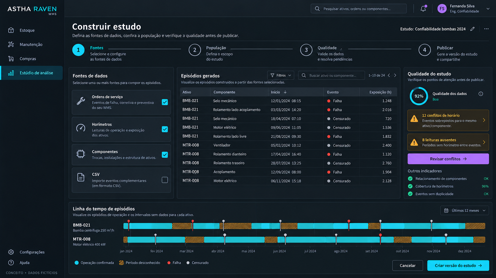
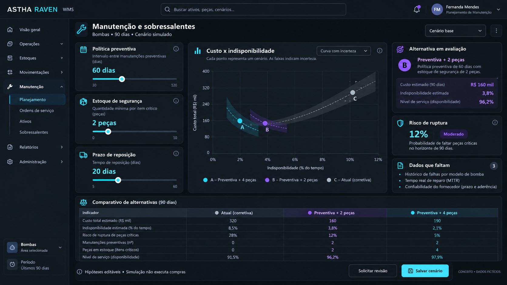
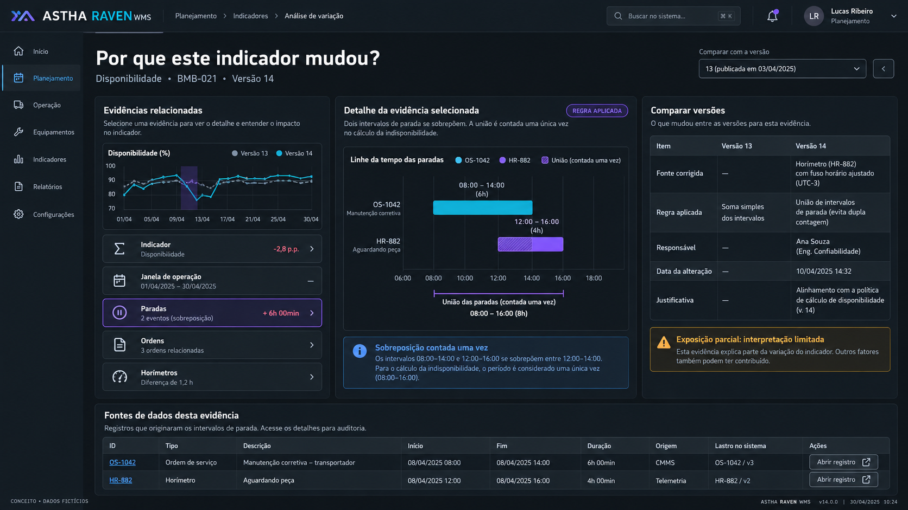

# Galeria funcional — três novos mockups

30/09/2026 · complemento aos 15 wireframes e ao mockup de confiabilidade originais.

Imagens geradas com image_gen nativo e inspecionadas visualmente. São conceitos com dados fictícios, não screenshots implementados ou resultados calculados. A especificação abaixo prevalece sobre detalhes inventados pelo gerador. Prompts finais em `MOCKUP_PROMPTS_V2.md`.

## 1. Construir estudo

**Objetivo:** construir uma população explícita com fontes e evidências. Ferramentas T01/T02/T07; entregas E1/E2/E3.

Fluxo: selecionar fontes → definir população/grão/relógio → revisar qualidade → publicar versão. Fontes operacionais vêm do servidor; arquivo vem de quarentena validada. Uma OS não vira falha automaticamente. Cabeçalho funcional apresenta pergunta, janela, relógio e rascunho/versão. Tabela tem início/fim, evento, exposição e origem; detalhe de linha abre fontes. Clicar em lacuna na timeline explica o desconhecido.

“Revisar conflitos” filtra questões; correção/exclusão exige motivo. “Criar versão” bloqueia violação de unidade, grão e acesso. Publicação congela receita; executar método é passo separado. A prévia paginada não altera contagens da população inteira.

Estados necessários: sem dados, fonte indisponível, importação validando, duplicata possível, unidade incompatível, exposição desconhecida, censura ambígua, exclusão motivada, dataset publicado e acesso revogado. Pode haver dados suficientes para descritivas e insuficientes para sobrevivência/regressão.

**Correção antes de implementar:** o gerador inventou “Qualidade dos dados 92% — Boa”. Substituir por medidas definidas, como “X de Y horas elegíveis têm exposição conhecida”, sem sugerir probabilidade de o estudo estar correto. Datas/durações desenhadas não são fixtures.

Aceite de UX: pessoa identifica população e exclusões, explica lacuna, abre fonte e sabe que publicação congela versão. Acessibilidade: tabela com cabeçalhos, eventos descritos por texto, alternativa tabular à timeline, foco de teclado preservado e painéis adaptáveis em telas menores.

## 2. Manutenção e sobressalentes

**Objetivo:** comparar políticas com falhas, recursos e fornecimento. Ferramentas T04/T05/T08/T12; entregas E5/E6.

Entradas: horizonte, população, política preventiva, estoque/reservas, embalagem, lead time, recursos e custos. Cada premissa mostra fonte ou “informada pelo usuário”. Slider também possui entrada numérica e unidade. Alterar valor cria rascunho; executar gera job. Resultado anterior mantém identificação até nova execução concluir.

Gráfico compara alternativas; tabela apresenta custo, indisponibilidade, espera e risco definidos no contrato. Mostrar dataset, sementes, replicações e diagnósticos. “Salvar cenário” preserva hipótese; “Solicitar revisão” inicia decisão e não compra. Método determina distribuição de prazo; média isolada não especifica toda distribuição.

Estados necessários: baseline ausente, hipótese incompleta, recurso insuficiente, cenário inviável, job em fila, precisão Monte Carlo insuficiente, resultado disponível e estado operacional alterado após aprovação. Não proclamar política vencedora para todos os contextos.

**Correções antes de implementar:** a imagem chama disponibilidade de “nível de serviço”; separar disponibilidade do ativo, fill rate de peças e probabilidade de ruptura. Faixas são decorativas: resultado real deve informar variabilidade, incerteza paramétrica ou erro Monte Carlo. O custo do ponto A não coincide com a tabela fictícia; gráfico e tabela funcionais precisam usar o mesmo objeto de resultado. Não interpolar curva contínua entre três alternativas sem modelo que a justifique.

Aceite de UX: usuário distingue dado de hipótese, localiza parâmetro que muda a escolha e entende a revisão pendente. Gráfico tem alternativa tabular; cor acompanha texto; alteração de premissa não fabrica resultado instantâneo.

## 3. Por que este indicador mudou?

**Objetivo:** explicar cálculo e revisão por fontes e regras. Ferramentas T02/T06; entregas E1/E2.

Cabeçalho apresenta indicador, população, versão e denominador. Painel esquerdo resume evidências; detalhe central abre intervalos; direito compara dado/regra/método/ambiente e limitações; tabela inferior abre registro autorizado. Fonte inacessível não vaza detalhes. Editar interpretação cria nova versão, nunca muda snapshot publicado.

Exemplo didático: paradas 08h–14h e 12h–16h têm união de oito horas, com sobreposição contada uma vez. Só combinar intervalos compatíveis com definição de indisponibilidade. Datas e efeitos no indicador são fictícios.

Estados necessários: fonte legada sem linhagem, retenção removeu origem, permissão revogada, exposição parcial, correção pendente, regra alterada e versões incomparáveis por janela diferente. A interface distingue limitação de acesso e ausência de dado.

**Correções antes de implementar:** `HR-882`/“Horímetro” foi desenhado como intervalo “Aguardando peça”. É erro semântico visual; segundo intervalo deve referenciar parada/espera, por exemplo `PD-2042`. Leitura de horímetro permanece evidência de exposição. O “+6h” lateral e variação de disponibilidade não derivam dos intervalos; remover ou calcular de comparação real. A lista é resumo de evidências, não um grafo PROV completo.

Aceite de UX: pessoa encontra registro e regra responsáveis pela mudança e identifica o que ainda não foi explicado. Acessibilidade: início/fim/duração em texto, equivalência tabular, foco previsível e alterações descritas sem depender de cor/posição.

## 4. Coerência e percurso completo

Menus e nomes fictícios variam entre imagens. Implementação deve usar navegação e componentes reais do ASTHA, testar contraste e responsividade e validar compreensão com manutenção/suprimentos. Não copiar literalmente detalhes inventados.

Percurso: pergunta → população → revisão → versão publicada → método elegível → execução → diagnóstico → cenários → decisão revisada → revalidação → ação operacional. Usuário pode concluir apenas um estudo sem executar qualquer ação.

A galeria complementa `ANALYTICS_UX_SPEC.md`; o plano em `IMPLEMENTATION_BLUEPRINT_V2.md` define módulos e entregas; sete diagramas editáveis em `CONSTRUCTION_ARCHITECTURE_V2.md` descrevem construção e operação.
