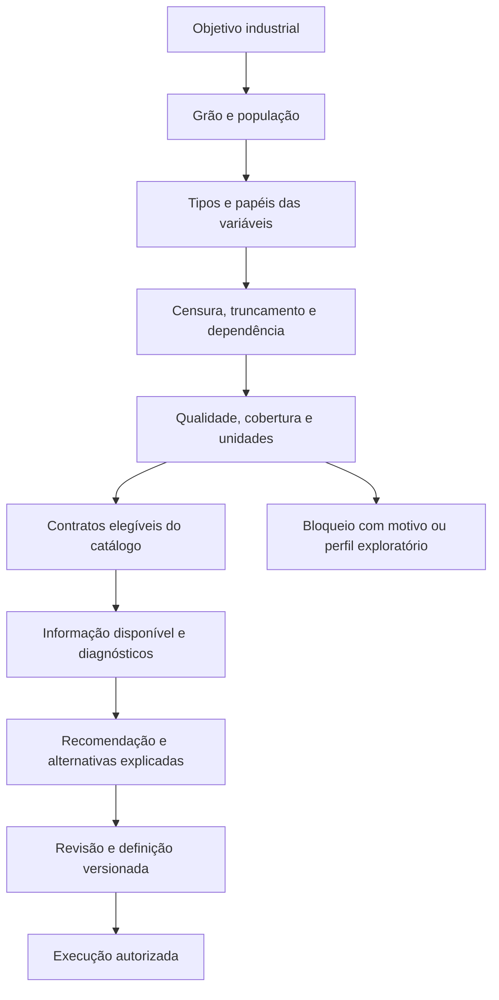

# Catálogo estatístico e regras de recomendação

**Status:** especificação proposta, 30/09/2026. Nenhum método novo foi implementado ou homologado nesta etapa. P0 = fundação; P1 = alto valor industrial; P2 = avançado; P3 = especializado; P4 = sem prioridade atual. Prioridade não equivale a fase: um método P1 pode depender de dados ainda indisponíveis.

## 1. Inventário funcional do JASP

Famílias registradas no [catálogo oficial](https://jasp-stats.org/features/) e na [biblioteca de módulos](https://module-library.jasp-stats.org/), consultados nesta pesquisa. Este inventário agrupa capacidades; não promete equivalência de todas as opções.

| Família | Prioridade industrial | Alternativa no ASTHA |
|---|---|---|
| Descriptives | P0 | Sumários/ECDF |
| T-Tests | P2 | SciPy |
| ANOVA | P2 | statsmodels |
| Mixed Models | P2 | statsmodels/R |
| Regression | P2 | statsmodels |
| Frequencies | P1 | SciPy/GLM |
| Factor | P2/P3 | PCA/validação |
| Acceptance Sampling | P2 | Planos homologados |
| Audit | P3 | Auditoria específica |
| Bain | P3 | Bayes dirigido |
| Bayes Factor Functions | P3 | Bayes dirigido |
| BFpack | P3 | Modelo específico |
| BSTS | P3 | Worker dedicado |
| Circular Statistics | P3 | Sensores angulares |
| Cochrane Meta-Analyses | P4 | Sem prioridade |
| Distributions | P1 | SciPy/lifelines |
| Equivalence T-Tests | P2 | Equivalência homologada |
| JAGS | P3 | Bayes controlado |
| Learn Bayes | P3 | Ajuda contextual |
| Learn Stats | P1 | Ajuda contextual |
| Machine Learning | P2 | scikit-learn |
| Meta-Analysis | P3 | Estudos específicos |
| Network | P3 | Modelo específico |
| Power | P2 | Planejamento amostral |
| Predictive Analytics | P2 | Modelos validados |
| Process | P3 | Desenho específico |
| Prophet | P3 | Comparar baselines |
| Quality Control | P1/P2 | SPC/MSA |
| Reliability | P2 | Concordância/MSA |
| Robust T-Tests | P2 | Métodos robustos |
| SEM | P3 | R específico |
| Survival | P1 | lifelines/survival |
| Time Series | P1/P2 | statsmodels/forecast |
| Summary Statistics | P3 | Contrato restrito |
| Visual Modeling | P2 | Diagnósticos |

Pacotes subjacentes verificados em exemplos: `jaspSurvival` depende de `survival` e importa `flexsurv`, `ggsurvfit`, `jaspBase`, `jaspGraphs`; `jaspQualityControl` inclui, entre outros, `qcc`, `Rspc`, `fitdistrplus`, `FrF2`, `rsm` e `flexsurv`. Licenças desses dois módulos: GPL (>= 2). As licenças e dependências dos demais módulos não foram auditadas integralmente. [Survival](https://raw.githubusercontent.com/jasp-stats/jaspSurvival/master/DESCRIPTION), [Quality Control](https://raw.githubusercontent.com/jasp-stats/jaspQualityControl/master/DESCRIPTION).

**Decisão:** selecionar capacidades por problema industrial e homologar cada método. Não copiar automaticamente pacotes, textos ou interfaces de um módulo.

## 2. Contrato obrigatório de qualquer método

Cada entrada do catálogo precisa declarar: identificador e versão, objetivo, unidade da linha, tipos de variáveis, campos obrigatórios, censura/truncamento suportados, dependência/repetição suportada, parâmetros e limites, pressupostos, estimador, opções de IC, diagnósticos, advertências, política de dados ausentes, requisitos de recursos, schema de saída e evidência de homologação.

Estados possíveis: **exploratório**, **homologado para o contrato declarado**, **experimental restrito**, **retirado**. Uma alteração no tratamento de empates, perdas ou estimador é alteração de método, mesmo se o nome comercial permanece igual.

## 3. Matriz pergunta → dado → método → visual → limitação

| Pergunta | Dado mínimo | Método candidato | Visual padrão | Limitação principal |
|---|---|---|---|---|
| Como os valores se distribuem? | Medida/unidade | Descritiva, ECDF | Histograma + ECDF | Não inferir população a partir de conveniência |
| Aproximação Normal é plausível? | Medição contínua, contexto | Q–Q, diagnóstico | Q–Q + distribuição | p de normalidade não decide sozinho |
| Média difere entre grupos? | Grupo, resposta, desenho | Welch/GLM/robusto | Pontos + efeito/IC | Dependência e confundimento |
| A mesma unidade mudou? | ID, antes/depois | Pareado/misto | Trajetórias e diferenças | Não tratar pares como independentes |
| Mais falhas por exposição? | Contagens e exposição | Poisson/NB com offset | Taxas + IC | Sobredispersão e dependência |
| Quanto tempo até falhar? | Duração, evento, entrada | KM/paramétrico | Degraus + risco + IC | Censura/truncamento |
| Fabricantes diferem na vida? | Grupos/contexto/episódios | KM; Cox/AFT ajustado | Curvas + efeitos | Associação, não causalidade |
| Há desgaste? | Idade, falhas, exposição | Hazard/modelo apropriado | Taxa por idade + suporte | Não impor banheira |
| O ativo reparável piora? | Eventos acumulados e observação | ROCOF, HPP/PLP | Eventos/cumulativa | Reparo mínimo versus renovação |
| O que concentra perdas? | Falha, horas/custo | Pareto | Barras ordenadas + acumulada | Frequência não é criticidade |
| Processo está estável? | Sequência e subgrupo | Carta apropriada | Carta + limites | Autocorrelação/subgrupo |
| Processo atende especificações? | Processo, LSL/USL, MSA | Capacidade | Distribuição + especificações | Estabilidade e sigma correto |
| Quanto manter em estoque? | Demanda, lead time, política | Previsão/simulação | Cenários + distribuição | Serviço e custos definidos |
| Demanda é intermitente? | Calendário completo | ADI, CV², baselines | Série com zeros reais | Falta de registro ≠ zero |
| Quem entrega melhor? | Promessa/recebimentos | Quantis, OTD, survival | ECDF + dispersão | Mix e pedidos pendentes |
| Temperatura se relaciona à vibração? | Medidas alinhadas/contexto | Correlação/regressão | Scatter/resíduos | Autocorrelação e carga |
| Há anomalia? | Baseline e qualidade | Resíduos, SPC, ML posterior | Série + contexto | Incomum ≠ defeito |

## 4. Confiabilidade: requisitos matemáticos

### 4.1 Tempo de vida, exposição e censura

Uma linha deve representar uma unidade física ou **episódio de vida explicitamente definido**. O evento pode ser primeira falha, modo específico ou retirada, conforme objetivo. Uma retirada preventiva não é uma falha. Se a retirada depende de degradação, a censura pode ser informativa. Não atribuir censura não informativa automaticamente.

Horas, ciclos e idade de calendário são escalas distintas. Tempo de observação é a diferença entre contadores válidos ou duração segundo a base escolhida. Registrar o marco inicial, entrada tardia, última leitura confiável e motivo de saída. Componentes instalados antes do início do estudo podem exigir truncamento à esquerda/entrada tardia; não confundir com censura à esquerda. Falha conhecida entre inspeções é censura intervalar, não data exata inventada.

Kaplan–Meier padrão atende dados com censura à direita; variantes e estimadores para outras formas de censura exigem contrato próprio. Exibir população em risco, eventos e marcas de censura; mediana pode não ser estimável. [Documentação lifelines](https://lifelines.readthedocs.io/en/latest/Survival%20analysis%20with%20lifelines.html).

### 4.2 Weibull 2P e 3P

Para 2P, com forma β, escala η e tempo t ≥ 0:

\(R(t)=\exp[-(t/\eta)^\beta]\)

\(h(t)=(\beta/\eta)(t/\eta)^{\beta-1}\)

\(B_{10}=\eta[-\ln(0,9)]^{1/\beta}\)

β < 1 corresponde a hazard decrescente nesse modelo; β = 1, constante; β > 1, crescente. Uma Weibull 2P isolada é monotônica no hazard e **não reproduz uma banheira completa**. O intervalo de β e a adequação do modelo importam; β não identifica sozinho mecanismo físico. η não é a vida média. [NIST Weibull](https://www.itl.nist.gov/div898/handbook/apr/section1/apr162.htm).

Estimador inicial recomendado: máxima verossimilhança com censura suportada, otimização registrada e diagnóstico de identificabilidade. Comparar lognormal/exponencial e outros candidatos justificáveis; não selecionar automaticamente o menor AIC sem considerar população, extrapolação e plausibilidade. MLE, método gráfico e regressão de ranks não têm defaults equivalentes.

3P: limiar/localização é parâmetro adicional, potencialmente instável com pouca informação. Liberar apenas em modo avançado depois da homologação; justificar fisicamente, verificar perfil de verossimilhança e sensibilidade. Não oferecer como melhoria automática de 2P.

### 4.3 Banheira: investigação, não botão decorativo

O conceito apresenta taxa inicialmente decrescente, região aproximadamente constante e crescimento em desgaste. Os dados podem cobrir somente uma região ou nenhum padrão. Para analisar: calcular exposição por idade, separar modos, informar tamanho do risco em cada faixa e estimar incerteza. Misturas e modelos flexíveis podem produzir formas complexas, mas exigem dados e validação. A interface distingue curva conceitual de curva empírica. [NIST banheira](https://www.itl.nist.gov/div898/handbook/apr/section1/apr124.htm).

### 4.4 Cox, AFT e comparação

Log-rank é candidato para comparação de curvas sob suas condições, não prova de causa. Cox precisa de diagnóstico de proporcionalidade, covariáveis apropriadas, empates documentados e dependência por ativo tratada. Grupos com curvas cruzadas merecem revisão, RMST ou modelo alternativo conforme homologação. AFT fornece outra interpretação, ligada à escala temporal; não chamar sua razão de tempos de hazard ratio. [Regressão lifelines](https://lifelines.readthedocs.io/en/latest/Survival%20Regression.html).

Eventos competidores: falha por corrosão impede observar falha subsequente por desgaste na mesma vida. Para probabilidade por causa, avaliar incidência cumulativa; KM censurando causas concorrentes pode responder outra pergunta. Casos recorrentes exigem estrutura própria. [Descrição survival com Aalen–Johansen](https://raw.githubusercontent.com/therneau/survival/master/DESCRIPTION), [flexsurv](https://www.jstatsoft.org/article/view/v070i08).

### 4.5 Reparáveis e métricas

Para uma máquina reparável, estudar sequência de ocorrências e intensidade (ROCOF), e registrar se reparo restaura como novo, minimamente ou de forma intermediária. PLP/Crow–AMSAA modela tendência de ocorrências; seu parâmetro de tendência não tem o mesmo papel físico que β da distribuição de vida de uma peça. [NIST reparáveis](https://www.itl.nist.gov/div898/handbook/apr/section1/apr121.htm), [NIST crescimento](https://www.itl.nist.gov/div898/handbook/apr/section1/apr19.htm).

| Métrica | Definição operacional proposta | Condição |
|---|---|---|
| MTBF observado | Exposição operacional total / falhas qualificadas | População reparável, eventos e exposição consistentes |
| MTTF | Esperança da vida até evento | Distribuição e cauda estimáveis; média pode não ser identificada com censura |
| MTTR ativo | Tempo ativo de reparo / reparos concluídos | Registrar início/fim de reparo; excluir espera quando definição pedir |
| MDT | Indisponibilidade total / episódios completos | Inclui esperas conforme política explícita |
| Disponibilidade observada | Tempo disponível / tempo requerido | Consolidar intervalos e calendário |
| Disponibilidade intrínseca | MTBF / (MTBF + MTTR) | Modelo/definições compatíveis; não substitui disponibilidade observada geral |
| Taxa/intensidade | Eventos / exposição | Distinguir resumo empírico de hazard/modelo |
| Mantenabilidade | Probabilidade de reparo concluído até t | Tempos de reparo e censura apropriados |

Zero falhas: apresentar exposição e, sob HPP de taxa constante, limite superior unilateral \(\lambda_U=-\ln(\alpha)/T\). É um limite sob hipótese, não estimativa de vida infinita. [NIST HPP](https://www.itl.nist.gov/div898/handbook/apr/section4/apr451.htm).

## 5. Estatística geral e qualidade

Descritiva: n total/válido/ausente, soma quando semanticamente válida, média, mediana, quantis, dispersão, IQR, assimetria e frequências. Definir convenção de quantil, `ddof` da variância e tratamento de empates. Modo de medidas contínuas depende de discretização e pode não ser útil. Valores extremos são marcados; exclusão precisa de justificativa persistida.

Normal: usar Q–Q, desenho de coleta e diagnóstico; um teste de normalidade não determina sozinho t versus não paramétrico. Para modelos, a hipótese pode ser sobre resíduos, não sobre toda variável bruta. Mann–Whitney não é automaticamente “teste de medianas”; sua interpretação depende das distribuições. ANOVA e medidas repetidas precisam do desenho, não apenas número de grupos.

Comparações: definir contraste e magnitude relevante antes de explorar; priorizar efeito + IC; ajustar multiplicidade por família de hipóteses. Correlação ≠ causalidade; sem variabilidade, correlação pode ser indefinida. Regressões exigem resíduos, colinearidade, dependência e modelo de resposta correto. Contagens pedem exposição/offset; binárias pedem denominadores.

SPC: I–MR para individuais em contexto apropriado; X̄–R/X̄–S para subgrupos racionais; p/np para frações/contagens de unidades não conformes; c/u para defeitos com oportunidades definidas; EWMA/CUSUM para mudanças pequenas após baseline homologado. Não lançar dezenas de regras simultâneas sem medir falso alarme.

Cp/Cpk usam variabilidade dentro do processo conforme estimador; Pp/Ppk usam variabilidade global segundo convenção documentada. Especificação não é limite de controle. Capacidade clássica deve vir acompanhada da avaliação de estabilidade, distribuição e sistema de medição; não preencher indicador quando pressupostos estiverem ausentes. [NIST estabilidade](https://www.itl.nist.gov/div898/handbook/ppc/section4/ppc45.htm), [NIST capacidade](https://www.itl.nist.gov/div898/handbook/pmc/section1/pmc16.htm).

Gauge R&R: registrar peça, operador, repetição, instrumento e desenho cruzado/aninhado; não executar estudo sem essa estrutura. PCA exige escala, treino sem vazamento e interpretação de componentes; não diagnostica falha por si só. Bayes deve resolver perguntas concretas — por exemplo, taxa com evidência histórica — com prior, análise de sensibilidade e checagem posterior explícitos.

## 6. Estoque e compras

### 6.1 ABC/XYZ e criticidade

ABC depende da métrica escolhida: valor de consumo, gasto ou custo de risco não são a mesma coisa. Percentuais cumulativos e tratamento de empates devem ser configuráveis e versionados; 80/15/5 é exemplo de política, não lei estatística. XYZ por CV pode falhar com média zero, sazonalidade e intermitência. Usar ADI e CV² de demandas positivas como caracterização complementar; limiares populares são heurísticos, sujeitos a validação na carteira.

Uma peça barata de classe C pode parar a planta. Exibir criticidade e base instalada separadas da matriz ABC/XYZ. Recomendar política não somente pela posição na matriz.

### 6.2 Previsão e reposição

Separar demanda planejada de consumo emergencial; registrar períodos sem demanda, com coleta ausente e com ruptura. Comparar baseline ingênuo/média, sazonal quando aplicável, Croston/SBA/TSB para intermitência e simulação para política. Croston clássico não fornece automaticamente uma distribuição preditiva coerente; intervalos exigem método adicional validado. [FPP3](https://otexts.com/fpp3/counts.html), [artigo TSB](https://pure.rug.nl/ws/portalfiles/portal/145394864/Intermittent_demand_Linking_forecasting_to_inventory_obsolescence.pdf).

No caso restrito de demanda por período independente, lead time constante L e aproximação Normal razoável: estoque de segurança candidato \(SS=z\sigma_D\sqrt{L}\), ponto de pedido \(ROP=\mu_D L+SS\). Com lead time aleatório independente, aproximação \(Var(D_L)=E[L]Var(D)+Var(L)E[D]^2\). Essas expressões são recomendações condicionais derivadas de somas aleatórias; não funcionam como regra universal para sobressalentes. Revisão periódica incorpora também o intervalo de revisão; peças reparáveis exigem pipeline de reparo e políticas específicas.

Cycle service level e fill rate são objetivos distintos. “95% de serviço” precisa indicar qual deles. Stock disponível, reservado, em trânsito, backlog e pedido pendente devem formar uma posição de estoque definida; evitar contar compromisso duas vezes. Quantidade sugerida deve respeitar conversão de unidade, lote, mínimo de compra e orçamento depois da avaliação estatística.

Validação: janela temporal rolling origin, erros por item/grupo, viés e custo/serviço da política simulada. MAPE é inadequado com muitos zeros. MASE/RMSSE podem ter denominador zero; reportar indisponibilidade e alternativa. Backtest deve simular o que era conhecido na data, sem receber pedidos ou falhas futuras.

### 6.3 Fornecedor

Lead time: separar emissão interna, envio ao fornecedor, confirmação, despacho, recebimento e liberação de qualidade. Relatar mediana, P90/P95 quando sustentados, dispersão e cobertura. Pedidos abertos não podem desaparecer da análise; para tempo até entrega, são potencialmente censurados com objetivo e hipótese declarados.

OTD: entrega até promessa original ou revisada? Definir; versionar alterações para evitar melhoria artificial. OTIF: no prazo e quantidade completa/aceita, com regra para parcial. Comparar por item/categoria, faixa de volume e urgência. Não consolidar preço sem unidade, moeda, data e fatores tributários/logísticos conhecidos. Qualificação administrativa não é medida estatística de desempenho.

## 7. Motor de recomendação explicável

Recomendação inicial determinística, versionada e auditável:

1. Identificar pergunta e objetivo de decisão.
2. Confirmar grão, unidade observacional e população.
3. Examinar tipo e papel semântico; distinguir resposta, exposição e grupo.
4. Detectar censura/truncamento, repetição, cluster e dimensão temporal.
5. Validar qualidade, cobertura e compatibilidade de unidades.
6. Produzir lista de métodos elegíveis pelo contrato.
7. Avaliar quantidade de informação, desenho e diagnósticos.
8. Mostrar recomendação, justificativa, alternativas e restrições.
9. Persistir regra e evidências antes de executar.

Não adotar limiar universal “n ≥ 30” ou “10 falhas por variável” como selo de validade. Política mínima deve considerar informação de eventos, complexidade, cobertura e estudos de simulação. Normalidade, p-valor e IA não substituem essa avaliação.

Exemplo de regra: objetivo comparar vida, duração positiva, censura à direita válida e grupo conhecido → recomendar KM exploratório; ajustar modelo se contexto e contrato permitirem. Presença de várias vidas no mesmo ativo → declarar cluster e avaliar método que o suporta. Evento desconhecido → bloquear inferência até resolver, permitindo perfil de dados.

A IA futura poderá converter linguagem natural em uma proposta estruturada de população, variáveis, filtros e método. A execução continua restrita ao catálogo e à autorização do servidor. Não executar código, SQL, fórmulas ou pacotes sugeridos livremente pela IA ou presentes nas células.
